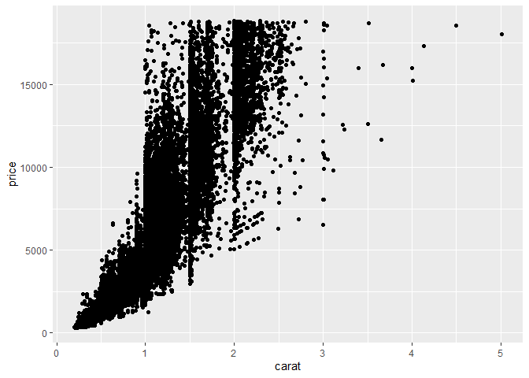
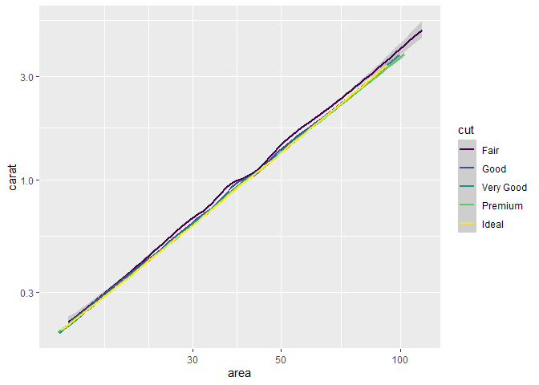

Getting Started: Diamonds
================
Paul Titchener
2020-7-12

  - [Grading Rubric](#grading-rubric)
      - [Individual](#individual)
      - [Team](#team)
      - [Due Date](#due-date)
  - [Data Exploration](#data-exploration)
  - [Communication](#communication)

*Purpose*: Throughout this course, you’ll complete a large number of
*exercises* and *challenges*. Exercises are meant to introduce content
with easy-to-solve problems, while challenges are meant to make you
think more deeply about and apply the content. The challenges will start
out highly-scaffolded, and become progressively open-ended.

In this challenge, you will go through the process of exploring,
documenting, and sharing an analysis of a dataset. We will use these
skills again and again in each challenge.

<!-- include-rubric -->

# Grading Rubric

<!-- -------------------------------------------------- -->

Unlike exercises, **challenges will be graded**. The following rubrics
define how you will be graded, both on an individual and team basis.

## Individual

<!-- ------------------------- -->

| Category    | Unsatisfactory                                                                   | Satisfactory                                                               |
| ----------- | -------------------------------------------------------------------------------- | -------------------------------------------------------------------------- |
| Effort      | Some task **q**’s left unattempted                                               | All task **q**’s attempted                                                 |
| Observed    | Did not document observations                                                    | Documented observations based on analysis                                  |
| Supported   | Some observations not supported by analysis                                      | All observations supported by analysis (table, graph, etc.)                |
| Code Styled | Violations of the [style guide](https://style.tidyverse.org/) hinder readability | Code sufficiently close to the [style guide](https://style.tidyverse.org/) |

## Team

<!-- ------------------------- -->

| Category   | Unsatisfactory                                                                                   | Satisfactory                                       |
| ---------- | ------------------------------------------------------------------------------------------------ | -------------------------------------------------- |
| Documented | No team contributions to Wiki                                                                    | Team contributed to Wiki                           |
| Referenced | No team references in Wiki                                                                       | At least one reference in Wiki to member report(s) |
| Relevant   | References unrelated to assertion, or difficult to find related analysis based on reference text | Reference text clearly points to relevant analysis |

## Due Date

<!-- ------------------------- -->

All the deliverables stated in the rubrics above are due on the day of
the class discussion of that exercise. See the
[Syllabus](https://docs.google.com/document/d/1jJTh2DH8nVJd2eyMMoyNGroReo0BKcJrz1eONi3rPSc/edit?usp=sharing)
for more information.

``` r
library(tidyverse)
```

    ## -- Attaching packages ------------------------------------------------------------------------------------------------ tidyverse 1.3.0 --

    ## v ggplot2 3.3.2     v purrr   0.3.4
    ## v tibble  3.0.1     v dplyr   1.0.0
    ## v tidyr   1.1.0     v stringr 1.4.0
    ## v readr   1.3.1     v forcats 0.5.0

    ## -- Conflicts --------------------------------------------------------------------------------------------------- tidyverse_conflicts() --
    ## x dplyr::filter() masks stats::filter()
    ## x dplyr::lag()    masks stats::lag()

# Data Exploration

<!-- -------------------------------------------------- -->

In this first stage, you will explore the `diamonds` dataset and
document your observations.

**q1** Create a plot of `price` vs `carat` of the `diamonds` dataset
below. Document your observations from the visual.

*Hint*: We learned how to do this in `e-vis00-basics`\!

``` r
## TASK: Plot `price` vs `carat` below
## Your code here!
ggplot(diamonds) + 
  geom_point(mapping = aes(x = carat, y = price))
```

<!-- -->

**Observations**:

  - Price generally increases with size.

  - Very large diamonds are generally not as well cut as smaller ones,
    and are therefore not significantly more expensive.

  - 
**q2** Create a visualization showing variables `carat`, `price`, and
`cut` simultaneously. Experiment with which variable you assign to which
aesthetic (`x`, `y`, etc.) to find an effective visual.

``` r
## TASK: Plot `price`, `carat`, and `cut` below
## Your code here!
ggplot(diamonds) + 
  geom_point(mapping = aes(x = carat, y = price, color = cut))
```

<!-- -->

**Observations**:

# Communication

<!-- -------------------------------------------------- -->

In this next stage, you will render your data exploration, push it to
GitHub to share with others, and link your observations within our [Data
Science
Wiki](https://olin-data-science.fandom.com/wiki/Olin_Data_Science_Wiki).

``` r
## TASK: Plot `price`, `carat`, and `cut` below
## Your code here!
##ggplot(diamonds) + 
##  geom_point(mapping = aes(x = carat, y = price, color = cut) + )
diamonds %>%
  ggplot(aes(carat, price, color = cut)) + 
  geom_smooth() + 
  scale_x_log10() +
  scale_y_log10()
```

    ## `geom_smooth()` using method = 'gam' and formula 'y ~ s(x, bs = "cs")'

<!-- -->
(Code taken from Zack Del Rosario’s report as an example to start from)

Hypothesis 1. The area of the top of the diamond relates the the price
more closely than the carat because that represents the actual visual
size of the stone.

``` r
diamonds$area <- diamonds$x * diamonds$y
diamonds %>%
  filter(area<120 & area > 1) %>% 
  ggplot() + 
  geom_smooth(aes(area, price, color = cut)) + 
  scale_x_log10() +
  scale_y_log10()
```

    ## `geom_smooth()` using method = 'gam' and formula 'y ~ s(x, bs = "cs")'

<!-- -->

This plot is very similar to the previous plot - it does not appear that
this hypothesis is correct in that area is not more related to the price
than carat, although they are similar.

``` r
diamonds$area <- diamonds$x * diamonds$y
diamonds %>%
  filter(area<120 & area > 1) %>% 
  ggplot() + 
  geom_smooth(aes(area, carat, color = cut)) + 
  scale_x_log10() +
  scale_y_log10()
```

    ## `geom_smooth()` using method = 'gam' and formula 'y ~ s(x, bs = "cs")'

<!-- -->

Area and carat are very closely related, in all of the different cuts of
stone. Fair cut diamonds appear to be slightly larger, which would make
sense because of the poorer cut.

Hypothesis - more porly cut diamonds have more variation in table,
because they were cut that way in order to preserve size. Taken from
reading <https://en.wikipedia.org/wiki/Diamond_(gemstone)#Cut>

``` r
diamonds %>%
  ggplot() + 
  geom_boxplot(aes(cut, table, color = cut))
```

<!-- -->

This hypothesis seems accurate.

Hypothesis: the largest diamonds are the most poorly cut, based on the
table percentage

``` r
diamonds %>% 
  filter(carat > 3) %>% 
  ggplot() + 
  geom_point(aes(carat, table, color = cut))
```

<!-- -->

This hypothesis seems to be incorrect. There doesn’t seem to be much
correlation in the diamonds above 3 carats between the table and the
cut. This may be because the largest diamonds have a different cut
strategy than the smaller ones.

Hypothesis: Diamonds that are very close to a numerical differentiation
in carat (1.0, 0.5 etc) are more likely to be poorly cut to preserve
size (and therefore price).

``` r
diamondSizes <- filter(diamonds, carat<1.5)
diamondSizes1 <- diamondSizes$carat
hist(diamondSizes1, breaks = 400)
```

<!-- -->

Important breaks appear to be: 0.3, 0.5 0.7, 0.9 and 1.0

``` r
diamonds %>% 
  filter(carat > 1.0 & carat < 1.1) %>% 
  ggplot(aes(x = cut))+
  geom_bar()
```

<!-- -->

This plot isn’t very helpful - it doesn’t compare well between an area
where the size is close to a breakpoint and an area where it is not.

It looks like it would be useful to compute the percentage of premium +
ideal and compare that over sizes

What needs to happen: Create bins for diamond size Compute of cuts

``` r
cutBins = c((20:199)/100)
counter <- 0
ratio1 <-  c(1:180)

for (val in cutBins) {
  Cuts <- diamonds %>% 
    filter(carat<val & carat >= (val-0.1)) %>% 
    count(cut)
  ratio1[counter]  <-  (Cuts$n[4] + Cuts$n[5]) / sum(Cuts$n)
  #test <- (Cuts$n[4] + Cuts$n[5]) / sum(Cuts$n)
  counter = counter+1
}
plot(cutBins,ratio1,ylim=0:1,xlab = "Diamond Size (Carats)", ylab = "Ideal and Premium Diamond")
```

<!-- -->

It appears that the ratio ideal and premium diamonds does decrease
closer to the breakpoints of carat.This is especially noticeable at 0.3
carats, 1.0 carats and 1.5 carats.

``` r
cutBins = c((20:199)/100)
counter <- 0
ratio1 <-  c(1:180)

for (val in cutBins) {
  Cuts <- diamonds %>% 
    filter(carat<val & carat >= (val-0.1)) %>% 
    count(cut)
  ratio1[counter]  <-  (Cuts$n[5]) / sum(Cuts$n)
  #test <- (Cuts$n[4] + Cuts$n[5]) / sum(Cuts$n)
  counter = counter+1
}
plot(cutBins,ratio1,ylim=0:1,xlab = "Diamond Size (Carats)", ylab = "Ratio of Ideal Diamonds")
```

<!-- -->
This is a similar trend when limited to only ideal cut diamonds.

**q3** *Knit* your document in order to create a report.

You can do this by clicking the “Knit” button at the top of your
document in RStudio.

This will create a local `.md` file, and RStudio will automatically open
a preview window so you can view your knitted document.

**q4** *Push* your knitted document to GitHub.

You will need to stage both the `.md` file, as well as the `_files`
folder. Note that the `_files` folder, when staged, will expand to
include all the files under that directory.

**q5** *Document* your findings in our
[Wiki](https://olin-data-science.fandom.com/wiki/Olin_Data_Science_Wiki).
Work with your learning team to come to consensus on your findings.

The [Datasets](https://olin-data-science.fandom.com/wiki/Datasets) page
contains lists all the datasets we’ve analyzed together.

**q6** *Prepare* to present your team’s findings\!

**q7** Add a link to your personal data-science repository on the
[Repositories](https://olin-data-science.fandom.com/wiki/Repositories)
page. Make sure to file it under your team name\!
