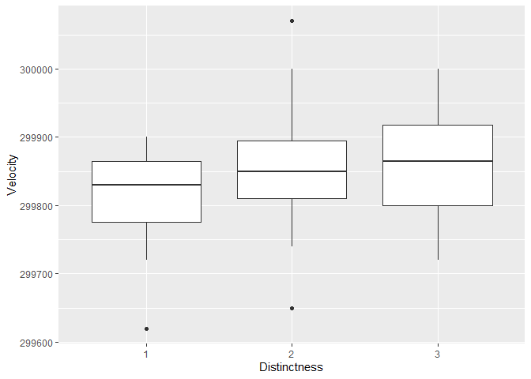
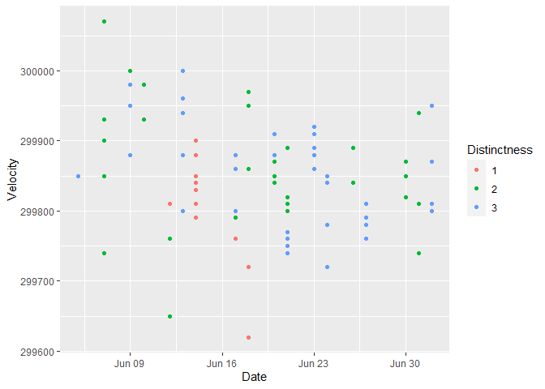
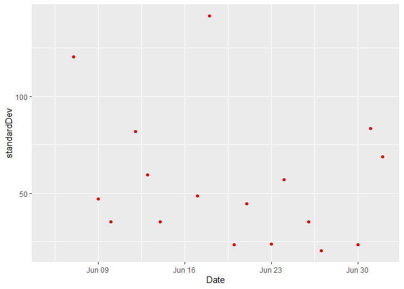
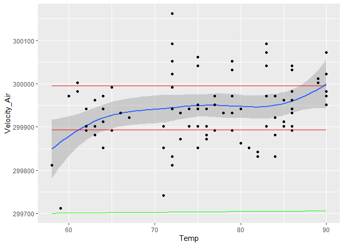
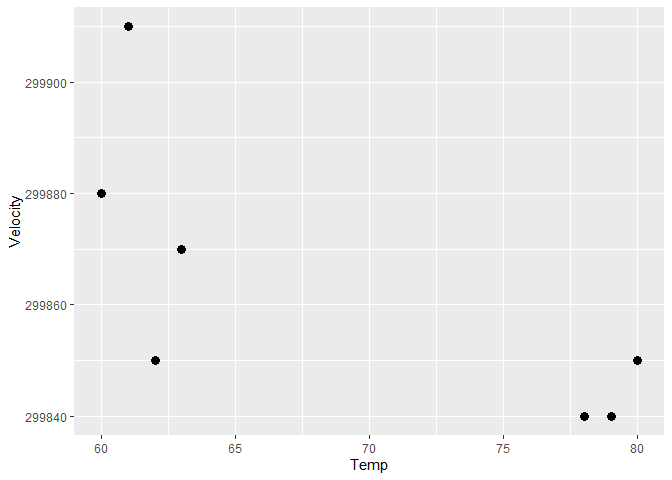

Michelson Speed-of-light Measurements
================
Paul Titchener
7/18/20

  - [Grading Rubric](#grading-rubric)
      - [Individual](#individual)
      - [Team](#team)
      - [Due Date](#due-date)
      - [Bibliography](#bibliography)

*Purpose*: When studying physical problems, there is an important
distinction between *error* and *uncertainty*. The primary purpose of
this challenge is to dip our toes into these factors by analyzing a real
dataset.

*Reading*: [Experimental Determination of the Velocity of
Light](https://play.google.com/books/reader?id=343nAAAAMAAJ&hl=en&pg=GBS.PA115)
(Optional)

<!-- include-rubric -->

# Grading Rubric

<!-- -------------------------------------------------- -->

Unlike exercises, **challenges will be graded**. The following rubrics
define how you will be graded, both on an individual and team basis.

## Individual

<!-- ------------------------- -->

| Category    | Unsatisfactory                                                                   | Satisfactory                                                               |
| ----------- | -------------------------------------------------------------------------------- | -------------------------------------------------------------------------- |
| Effort      | Some task **q**’s left unattempted                                               | All task **q**’s attempted                                                 |
| Observed    | Did not document observations                                                    | Documented observations based on analysis                                  |
| Supported   | Some observations not supported by analysis                                      | All observations supported by analysis (table, graph, etc.)                |
| Code Styled | Violations of the [style guide](https://style.tidyverse.org/) hinder readability | Code sufficiently close to the [style guide](https://style.tidyverse.org/) |

## Team

<!-- ------------------------- -->

| Category   | Unsatisfactory                                                                                   | Satisfactory                                       |
| ---------- | ------------------------------------------------------------------------------------------------ | -------------------------------------------------- |
| Documented | No team contributions to Wiki                                                                    | Team contributed to Wiki                           |
| Referenced | No team references in Wiki                                                                       | At least one reference in Wiki to member report(s) |
| Relevant   | References unrelated to assertion, or difficult to find related analysis based on reference text | Reference text clearly points to relevant analysis |

## Due Date

<!-- ------------------------- -->

All the deliverables stated in the rubrics above are due on the day of
the class discussion of that exercise. See the
[Syllabus](https://docs.google.com/document/d/1jJTh2DH8nVJd2eyMMoyNGroReo0BKcJrz1eONi3rPSc/edit?usp=sharing)
for more information.

``` r
# Libraries
library(tidyverse)
library(googlesheets4)
library(lubridate)

url <- "https://docs.google.com/spreadsheets/d/1av_SXn4j0-4Rk0mQFik3LLr-uf0YdA06i3ugE6n-Zdo/edit?usp=sharing"

# Parameters
LIGHTSPEED_VACUUM    <- 299792.458 # Exact speed of light in a vacuum (km / s)
LIGHTSPEED_MICHELSON <- 299944.00  # Michelson's speed estimate (km / s)
LIGHTSPEED_PM        <- 51         # Michelson error estimate (km / s)
```

*Background*: In 1879 Albert Michelson led an experimental campaign to
measure the speed of light. His approach was a development upon the
method of Foucault, and resulted in a new estimate of
\(v_0 = 299944 \pm 51\) kilometers per second (in a vacuum). This is
very close to the modern *exact* value of `r LIGHTSPEED_VACUUM`. In this
challenge, you will analyze Michelson’s original data, and explore some
of the factors associated with his experiment.

I’ve already copied Michelson’s data from his 1880 publication; the code
chunk below will load these data from a public googlesheet.

*Aside*: The speed of light is *exact* (there is **zero error** in the
value `LIGHTSPEED_VACUUM`) because the meter is actually
[*defined*](https://en.wikipedia.org/wiki/Metre#Speed_of_light_definition)
in terms of the speed of light\!

``` r
## Note: No need to edit this chunk!
gs4_deauth()
ss <- gs4_get(url)
df_michelson <-
  read_sheet(ss) %>%
  select(Date, Distinctness, Temp, Velocity) %>%
  mutate(Distinctness = as_factor(Distinctness))
```

    ## Reading from "michelson1879"

    ## Range "Sheet1"

``` r
df_michelson %>% glimpse
```

    ## Rows: 100
    ## Columns: 4
    ## $ Date         <dttm> 1879-06-05, 1879-06-07, 1879-06-07, 1879-06-07, 1879-...
    ## $ Distinctness <fct> 3, 2, 2, 2, 2, 2, 3, 3, 3, 3, 2, 2, 2, 2, 2, 1, 3, 3, ...
    ## $ Temp         <dbl> 76, 72, 72, 72, 72, 72, 83, 83, 83, 83, 83, 90, 90, 71...
    ## $ Velocity     <dbl> 299850, 299740, 299900, 300070, 299930, 299850, 299950...

*Data dictionary*:

  - `Date`: Date of measurement
  - `Distinctness`: Distinctness of measured images: 3 = good, 2 = fair,
    1 = poor
  - `Temp`: Ambient temperature (Fahrenheit)
  - `Velocity`: Measured speed of light (km / s)

**q1** Re-create the following table (from Michelson (1880), pg. 139)
using `df_michelson` and `dplyr`. Note that your values *will not* match
those of Michelson *exactly*; why might this be?

| Distinctness | n  | MeanVelocity |
| ------------ | -- | ------------ |
| 3            | 46 | 299860       |
| 2            | 39 | 299860       |
| 1            | 15 | 299810       |

``` r
## TODO: Compute summaries
df_q1 <- df_michelson
df_q1 %>%
  group_by(Distinctness) %>% 
  summarise(MeanVelocity = mean(Velocity), n = n()) %>% 
  arrange(desc(Distinctness)) %>%
  select(c("Distinctness","n",everything())) %>% 
  knitr::kable()
```

    ## `summarise()` ungrouping output (override with `.groups` argument)

| Distinctness |  n | MeanVelocity |
| :----------- | -: | -----------: |
| 3            | 46 |     299861.7 |
| 2            | 39 |     299858.5 |
| 1            | 15 |     299808.0 |

**Observations**: - Write your observations here\! - Why might your
table differ from Michelson’s?

Michaelson’s table appear to be rounded to the nearest 10 m/s. This
could be because of the uncertainty in his measurements.The velocity
table is also rounded to the tens digit. Expressing the mean with
greater precision than the measurements were taken with implies more
accuracy than there actually was.

The `Velocity` values in the dataset are the speed of light *in air*;
Michelson introduced a couple of adjustments to estimate the speed of
light in a vacuum. In total, he added \(+92\) km/s to his mean estimate
for `VelocityVacuum` (from Michelson (1880), pg. 141). While this isn’t
fully rigorous (\(+92\) km/s is based on the mean temperature), we’ll
simply apply this correction to all the observations in the dataset.

**q2** Create a new variable `n` with the \(+92\) km/s adjustment to
`Velocity`. Assign this new dataframe to `df_q2`.

``` r
## TODO: Adjust the data, assign to df_q2
df_q2 <- df_michelson %>% 
  mutate(Velocity_adj = Velocity + 92)
  

df_q2
```

    ## # A tibble: 100 x 5
    ##    Date                Distinctness  Temp Velocity Velocity_adj
    ##    <dttm>              <fct>        <dbl>    <dbl>        <dbl>
    ##  1 1879-06-05 00:00:00 3               76   299850       299942
    ##  2 1879-06-07 00:00:00 2               72   299740       299832
    ##  3 1879-06-07 00:00:00 2               72   299900       299992
    ##  4 1879-06-07 00:00:00 2               72   300070       300162
    ##  5 1879-06-07 00:00:00 2               72   299930       300022
    ##  6 1879-06-07 00:00:00 2               72   299850       299942
    ##  7 1879-06-09 00:00:00 3               83   299950       300042
    ##  8 1879-06-09 00:00:00 3               83   299980       300072
    ##  9 1879-06-09 00:00:00 3               83   299980       300072
    ## 10 1879-06-09 00:00:00 3               83   299880       299972
    ## # ... with 90 more rows

As part of his study, Michelson assessed the various potential sources
of error, and provided his best-guess for the error in his
speed-of-light estimate. These values are provided in
`LIGHTSPEED_MICHELSON`—his nominal estimate—and
`LIGHTSPEED_PM`—plus/minus bounds on his estimate. Put differently,
Michelson believed the true value of the speed-of-light probably lay
between `LIGHTSPEED_MICHELSON - LIGHTSPEED_PM` and `LIGHTSPEED_MICHELSON
+ LIGHTSPEED_PM`.

Let’s introduce some terminology:\[2\]

  - **Error** is the difference between a true value and an estimate of
    that value; for instance `LIGHTSPEED_VACUUM - LIGHTSPEED_MICHELSON`.
  - **Uncertainty** is an analyst’s *assessment* of the error.

Since a “true” value is often not known in practice, one generally does
not know the error. The best they can do is quantify their degree of
uncertainty. We will learn some means of quantifying uncertainty in this
class, but for many real problems uncertainty includes some amount of
human judgment.\[2\]

**q3** Compare Michelson’s speed of light estimate against the modern
speed of light value. Is Michelson’s estimate of the error (his
uncertainty) greater or less than the true error?

``` r
## TODO: Compare Michelson's estimate and error against the true value
## Your code here!

MichaelsonError <-  LIGHTSPEED_VACUUM - LIGHTSPEED_MICHELSON
percentError = MichaelsonError / LIGHTSPEED_VACUUM *100

print(MichaelsonError)
```

    ## [1] -151.542

``` r
print(LIGHTSPEED_MICHELSON)
```

    ## [1] 299944

``` r
print(LIGHTSPEED_VACUUM)
```

    ## [1] 299792.5

``` r
print(percentError)
```

    ## [1] -0.05054897

**Observations**: This is not necessarily a reasonable comparison. We
are comparing very slightly dissimilar units, because the meter has been
redefined since Michelson took his measurements. While all of the meters
are technically the same length, the precision of that measurement
varies over the different measurements. Michaelsons’s error was 0.05%,
which is approximately half a millimeter over a 1 meter length.

Michaelson’s error was greater than his uncertainty.

**q4** You have access to a few other variables. Construct a few
visualizations of `VelocityVacuum` against these other factors. Are
there other patterns in the data that might help explain the difference
between Michelson’s estimate and `LIGHTSPEED_VACUUM`?

Visualization of distinctness versus the velocity:

``` r
df_michelson %>% 
  ggplot() + 
  geom_boxplot(aes(Distinctness,Velocity))
```

<!-- -->
Observations:

The only plot that has a somewhat clear correlation between velocity and
another parameter is “Distinctness.” As the distinctness of the
measurement rises, so does the speed of light.

The speed of light versus the date the data was collected. This might
show if there was some wear in the mechanical apparatus, or if
Michaelson became more proficient at taking the measurement over time.

``` r
df_michelson %>% 
  mutate(velocityError = LIGHTSPEED_MICHELSON - (Velocity + 92)) %>% 
  ggplot() + 
  geom_point(aes(Date,Velocity,color = Distinctness))
```

<!-- -->
Observations: Michaelson does not appear to get much better as he takes
measurements. The data is relatively consistent from the beginning of
his measurment period to the end.

Plot of the standard deviation of the error over time - do Michaelson’s
experiments become more consistent over time?

``` r
df_michelson %>% 
  mutate(velocityError = LIGHTSPEED_MICHELSON - (Velocity + 92)) %>% 
  group_by(Date) %>% 
  summarise(standardDev = sd(velocityError),meanError = mean(velocityError)) %>% 
  ggplot() + 
  geom_point(aes(Date, standardDev), color = "Red") 
```

    ## `summarise()` ungrouping output (override with `.groups` argument)

    ## Warning: Removed 1 rows containing missing values (geom_point).

<!-- -->

``` r
  #geom_point(aes(Date, meanError), color = "Blue")
```

Observations: As noted in the previous plot, his observations do not
appear to get better over time.

Investigation into the speed of light’s refractive index and temperature
error:

``` r
rIndex = 1.000293 
df_Refracted <-  df_michelson %>% 
  mutate(Velocity_Vacuum = 299792.5) %>% 
  mutate(T_K = (Temp - 32)*5/9 + 273.15) %>% 
  mutate(rIndexTemp = 1 + (0.000293 *300/T_K), Velocity_Air = LIGHTSPEED_VACUUM / rIndexTemp) %>%  
  mutate(LIGHTSPEED_MICHELSON = LIGHTSPEED_MICHELSON) %>% 
  mutate(Error = LIGHTSPEED_PM)

df_Refracted %>% 
  ggplot() + 
  geom_line(aes(Temp,Velocity_Air),color = "Green") + 
  geom_smooth(aes(Temp,Velocity+92)) + 
  geom_point(aes(Temp,Velocity+92)) +
  geom_line(aes(Temp,LIGHTSPEED_MICHELSON - Error),color = "Red") + 
  geom_line(aes(Temp,LIGHTSPEED_MICHELSON + Error),color = "Red")
```

    ## `geom_smooth()` using method = 'loess' and formula 'y ~ x'

<!-- -->
Observations:

There is some correlation between temperature and the velocity. A smooth
plot seems to show that the speed of light increases as the temperature
rises. This is in fact an actual physical affect of temperature, because
the refractive index of air decreases with temperature and increases
with pressure. However, this is a good example of a smooth plot being a
risky way of looking at the data. Looking at a point cloud of this data,
it seems to suggest this correlation, but much less clearly than the
smooth plot does. The spread of the data on individual days is larger
than the rise of the speed relating to temperature. The smooth plot is
also highly affected by serveral points at the edges. From this plot I
would conclude that there is minimal temperature affect on the data, and
that Michaelson compensated well for temperature changes from experiment
to experiment, but had some other source of error that would expain the
150km/s error in his data.

The green line on the bottom shows the change of the speed of light in
air based on temperature, showing that that affect is much smaller than
any of the spread in Michaelson’s data.

``` r
df_Refracted %>% 
  filter(Date == ymd("1879-06-20")) %>% 
  ggplot() + 
  geom_point(aes(Temp,Velocity),size = 3)
```

<!-- -->

Observations: I was curious if Michaelson’s data changed over the course
of the day due to thermal expansion as the day grew hotter and his
equipment reached equilibrium. Looking at plots of his data by day and
by temperature (the best proxy for time of day, as the measurements get
hotter over the day) doesn’t give enough data to confirm or disprove
this hypothesis. Looking at the previous plot of the data by
temperature, I would guess that his data does not change over the day,
given that the overall data seems to be well corrected for temperature.

## Bibliography

  - \[1\] Michelson, [Experimental Determination of the Velocity of
    Light](https://play.google.com/books/reader?id=343nAAAAMAAJ&hl=en&pg=GBS.PA115)
    (1880)
  - \[2\] Henrion and Fischhoff, [Assessing Uncertainty in Physical
    Constants](https://www.cmu.edu/epp/people/faculty/research/Fischoff-Henrion-Assessing%20uncertainty%20in%20physical%20constants.pdf)
    (1986)
