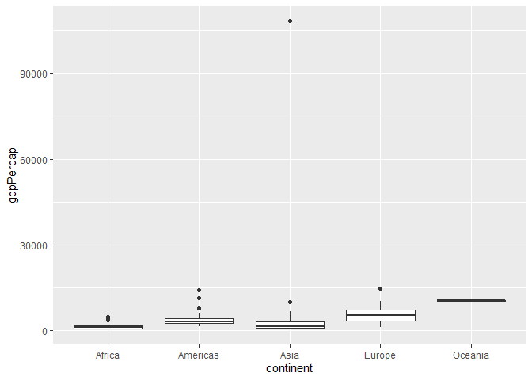
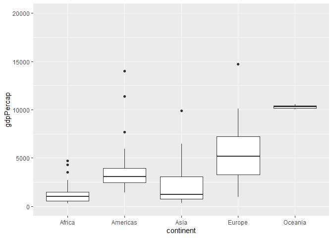
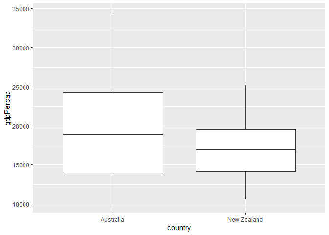
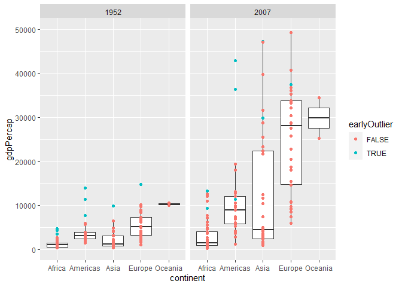
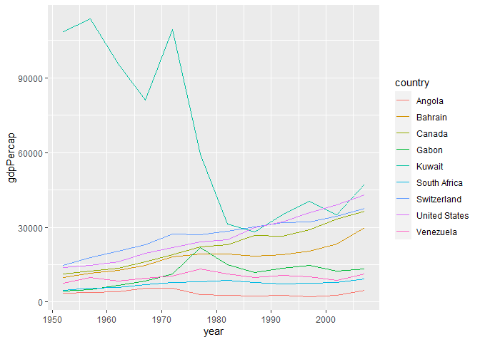
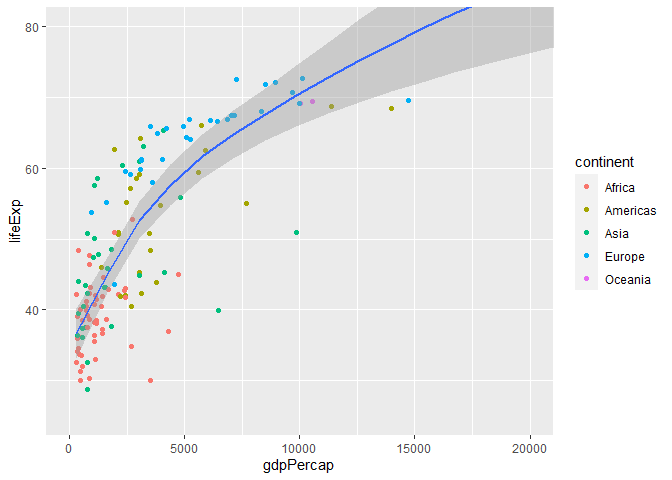
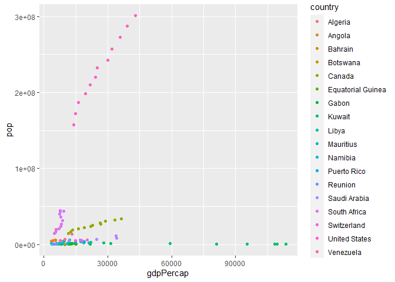
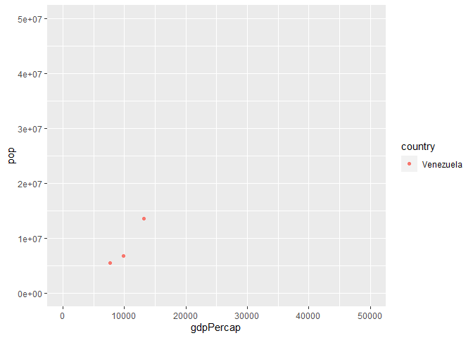

Gapminder
================
(Your name here)
2020-

  - [Grading Rubric](#grading-rubric)
      - [Individual](#individual)
      - [Team](#team)
      - [Due Date](#due-date)
  - [Guided EDA](#guided-eda)
  - [Your Own EDA](#your-own-eda)

*Purpose*: Learning to do EDA well takes practice\! In this challenge
you’ll further practice EDA by first completing a guided exploration,
then by conducting your own investigation. This challenge will also give
you a chance to use the wide variety of visual tools we’ve been
learning.

<!-- include-rubric -->

# Grading Rubric

<!-- -------------------------------------------------- -->

Unlike exercises, **challenges will be graded**. The following rubrics
define how you will be graded, both on an individual and team basis.

## Individual

<!-- ------------------------- -->

| Category    | Unsatisfactory                                                                   | Satisfactory                                                               |
| ----------- | -------------------------------------------------------------------------------- | -------------------------------------------------------------------------- |
| Effort      | Some task **q**’s left unattempted                                               | All task **q**’s attempted                                                 |
| Observed    | Did not document observations                                                    | Documented observations based on analysis                                  |
| Supported   | Some observations not supported by analysis                                      | All observations supported by analysis (table, graph, etc.)                |
| Code Styled | Violations of the [style guide](https://style.tidyverse.org/) hinder readability | Code sufficiently close to the [style guide](https://style.tidyverse.org/) |

## Team

<!-- ------------------------- -->

| Category   | Unsatisfactory                                                                                   | Satisfactory                                       |
| ---------- | ------------------------------------------------------------------------------------------------ | -------------------------------------------------- |
| Documented | No team contributions to Wiki                                                                    | Team contributed to Wiki                           |
| Referenced | No team references in Wiki                                                                       | At least one reference in Wiki to member report(s) |
| Relevant   | References unrelated to assertion, or difficult to find related analysis based on reference text | Reference text clearly points to relevant analysis |

## Due Date

<!-- ------------------------- -->

All the deliverables stated in the rubrics above are due on the day of
the class discussion of that exercise. See the
[Syllabus](https://docs.google.com/document/d/1jJTh2DH8nVJd2eyMMoyNGroReo0BKcJrz1eONi3rPSc/edit?usp=sharing)
for more information.

``` r
library(tidyverse)
```

    ## -- Attaching packages -------------------------------------------------------------------------------------------------------------- tidyverse 1.3.0 --

    ## v ggplot2 3.3.2     v purrr   0.3.4
    ## v tibble  3.0.1     v dplyr   1.0.0
    ## v tidyr   1.1.0     v stringr 1.4.0
    ## v readr   1.3.1     v forcats 0.5.0

    ## -- Conflicts ----------------------------------------------------------------------------------------------------------------- tidyverse_conflicts() --
    ## x dplyr::filter() masks stats::filter()
    ## x dplyr::lag()    masks stats::lag()

``` r
library(gapminder)
library(ggstatsplot)
```

    ## Registered S3 methods overwritten by 'broom.mixed':
    ##   method         from 
    ##   augment.lme    broom
    ##   augment.merMod broom
    ##   glance.lme     broom
    ##   glance.merMod  broom
    ##   glance.stanreg broom
    ##   tidy.brmsfit   broom
    ##   tidy.gamlss    broom
    ##   tidy.lme       broom
    ##   tidy.merMod    broom
    ##   tidy.rjags     broom
    ##   tidy.stanfit   broom
    ##   tidy.stanreg   broom

    ## Registered S3 methods overwritten by 'lme4':
    ##   method                          from
    ##   cooks.distance.influence.merMod car 
    ##   influence.merMod                car 
    ##   dfbeta.influence.merMod         car 
    ##   dfbetas.influence.merMod        car

    ## In case you would like cite this package, cite it as:
    ##      Patil, I. (2018). ggstatsplot: "ggplot2" Based Plots with Statistical Details. CRAN.
    ##      Retrieved from https://cran.r-project.org/web/packages/ggstatsplot/index.html

*Background*: [Gapminder](https://www.gapminder.org/about-gapminder/) is
an independent organization that seeks to education people about the
state of the world. They promote a “fact-based worldview” by focusing on
data. The dataset we’ll study in this challenge is from Gapminder.

# Guided EDA

<!-- -------------------------------------------------- -->

First, we’ll go through a round of *guided EDA*. Try to pay attention to
the high-level process we’re going through—after this guided round
you’ll be responsible for doing another cycle of EDA on your own\!

**q0** Perform your “first checks” on the dataset. What variables are in
this dataset?

``` r
#?gapminder
#glimpse(gapminder)
summary(gapminder)
```

    ##         country        continent        year         lifeExp     
    ##  Afghanistan:  12   Africa  :624   Min.   :1952   Min.   :23.60  
    ##  Albania    :  12   Americas:300   1st Qu.:1966   1st Qu.:48.20  
    ##  Algeria    :  12   Asia    :396   Median :1980   Median :60.71  
    ##  Angola     :  12   Europe  :360   Mean   :1980   Mean   :59.47  
    ##  Argentina  :  12   Oceania : 24   3rd Qu.:1993   3rd Qu.:70.85  
    ##  Australia  :  12                  Max.   :2007   Max.   :82.60  
    ##  (Other)    :1632                                                
    ##       pop              gdpPercap       
    ##  Min.   :6.001e+04   Min.   :   241.2  
    ##  1st Qu.:2.794e+06   1st Qu.:  1202.1  
    ##  Median :7.024e+06   Median :  3531.8  
    ##  Mean   :2.960e+07   Mean   :  7215.3  
    ##  3rd Qu.:1.959e+07   3rd Qu.:  9325.5  
    ##  Max.   :1.319e+09   Max.   :113523.1  
    ## 

**Observations**:

Country, continent, year, life expectancy, population and GDP per capita

**q1** Determine the most and least recent years in the `gapminder`
dataset.

``` r
## TASK: Find the largest and smallest values of `year` in `gapminder`
year_max <- 2007
year_min <- 1952
```

Use the following test to check your work.

``` r
## NOTE: No need to change this
assertthat::assert_that(year_max %% 7 == 5)
```

    ## [1] TRUE

``` r
assertthat::assert_that(year_max %% 3 == 0)
```

    ## [1] TRUE

``` r
assertthat::assert_that(year_min %% 7 == 6)
```

    ## [1] TRUE

``` r
assertthat::assert_that(year_min %% 3 == 2)
```

    ## [1] TRUE

``` r
print("Nice!")
```

    ## [1] "Nice!"

**q2** Filter on years matching `year_min`, and make a plot of the GDE
per capita against continent. Choose an appropriate `geom_` to visualize
the data. What observations can you make?

You may encounter difficulties in visualizing these data; if so document
your challenges and attempt to produce the most informative visual you
can.

``` r
gapminder %>% 
  filter(year == min(year)) %>%
  group_by(continent) %>% 
  ggplot() + 
  geom_boxplot(aes(x = continent, y = gdpPercap,group = continent)) #+ 
```

<!-- -->

``` r
  #ylim(c(0,20000))
```

``` r
gapminder %>% 
  filter(year == min(year)) %>%
  group_by(continent) %>% 
  ggplot() + 
  geom_boxplot(aes(x = continent, y = gdpPercap,group = continent)) + 
  coord_cartesian(
    ylim = c(0,20000)
  )
```

<!-- -->

``` r
gapminder %>% 
  filter(continent == "Oceania") %>% 
  ggplot() + 
  geom_boxplot(aes(x = country, y = gdpPercap, group = country))
```

<!-- -->

**Observations**:

There is a single outlier in Asia that completely warps the data and
makes most of the information completely off of the scale. The data can
be clipped to only show gdp per capita under $20,000, which makes the
rest of the data much more visible, but does ignore that one outlier.
The GDP per capita in Europe and oceanea are generally higher than the
other countries. I’m somewhat surprised that Oceania has the highest GDP
per capita average. This may be because of a limited set of countries
included in the dataset. This is explained in that the only two
countries included in 1952 for Oceania are Australian and New Zealand.

**Difficulties & Approaches**:

The main challenge was that one country was off of the chart and made
the rest of the data unreadable. My approach to solving that was to clip
the data to ignore that country, and provide two plots - one that showed
all of the data and one that only showed the clipped information.

**q3** You should have found at least three outliers in q2. Identify
those outliers (figure out which countries they are).

*Note*: I realize the reasons for

``` r
gapminder %>% 
  filter(year == min(year)) %>%
  group_by(continent) %>% 
  mutate(quartile1 = quantile(gdpPercap)[2], quartile2 = quantile(gdpPercap)[3] ,quartile3 = quantile(gdpPercap)[4]) %>% 
  mutate(IQR = quartile3 - quartile1) %>% 
  mutate(upperOutlier = (gdpPercap > quartile3 + (IQR * 1.5))) %>% 
  filter(upperOutlier == TRUE) %>% 
  arrange(continent) 
```

    ## # A tibble: 9 x 11
    ## # Groups:   continent [4]
    ##   country continent  year lifeExp    pop gdpPercap quartile1 quartile2 quartile3
    ##   <fct>   <fct>     <int>   <dbl>  <int>     <dbl>     <dbl>     <dbl>     <dbl>
    ## 1 Angola  Africa     1952    30.0 4.23e6     3521.      535.      987.     1455.
    ## 2 Gabon   Africa     1952    37.0 4.21e5     4293.      535.      987.     1455.
    ## 3 South ~ Africa     1952    45.0 1.43e7     4725.      535.      987.     1455.
    ## 4 Canada  Americas   1952    68.8 1.48e7    11367.     2428.     3048.     3940.
    ## 5 United~ Americas   1952    68.4 1.58e8    13990.     2428.     3048.     3940.
    ## 6 Venezu~ Americas   1952    55.1 5.44e6     7690.     2428.     3048.     3940.
    ## 7 Bahrain Asia       1952    50.9 1.20e5     9867.      750.     1207.     3035.
    ## 8 Kuwait  Asia       1952    55.6 1.60e5   108382.      750.     1207.     3035.
    ## 9 Switze~ Europe     1952    69.6 4.82e6    14734.     3241.     5142.     7237.
    ## # ... with 2 more variables: IQR <dbl>, upperOutlier <lgl>

``` r
  #mutate(medianGDP = median(gdpPercap)) %>%  
```

**Observations**:

The outliers are: Angola Gabon South Africa United States Venezuela
Bahrain Kuwait Switzerland

It seems that a number of these countries are very oil rich locations
with smaller populations. I’m curious to see the median income instead
of the average GDP per capita number. This statistic may be highly
warped by economic inequalities. It would be interesting to see the
median income in the these countries instead of the mean.

**q4** Create a plot similar to yours from q2 studying both `year_min`
and `year_max`. Find a way to highlight the outliers from q3 on your
plot. Compare the patterns between `year_min` and `year_max`.

*Hint*: We’ve learned a lot of different ways to show multiple
variables; think about using different aesthetics or facets.

``` r
outlierCountries = c("Angola","Gabon","South Africa","United States","Venezuela","Bahrain","Kuwait","Switzerland")

gapminderOutlier <- gapminder %>% 
  #filter(year == min(year)) %>%
  group_by(continent,year) %>% 
  mutate(quartile1 = quantile(gdpPercap)[2], quartile2 = quantile(gdpPercap)[3] ,quartile3 = quantile(gdpPercap)[4]) %>% 
  mutate(IQR = quartile3 - quartile1) %>% 
  mutate(upperOutlier = (gdpPercap > quartile3 + (IQR * 1.5))) %>% 
  ungroup() %>%  
  group_by(country) %>% 
  arrange(year, .by_group = TRUE) %>% 
  mutate(earlyOutlier = upperOutlier[1]) %>% 
  select(country, upperOutlier, earlyOutlier, everything())
  


gapminderOutlier %>% 
  filter(year == min(year) | year == max(year)) %>%
  group_by(continent) %>% 
  ggplot() + 
  geom_boxplot(aes(x = continent, y = gdpPercap,group = continent)) + 
  coord_cartesian(
    ylim = c(0,50000)
  ) + 
  geom_point(aes(x = continent, y = gdpPercap, color = earlyOutlier)) +
  facet_grid(.~year)
```

<!-- -->

**Observations**:

\-Wealth variations between the countries are largely preserved -Asia
and Specifically gain a lot of wealth in the IQR, while Africa and the
Americas gain less. - Countries that were outliers do not necessarily
remain outliers, but generally remain on the upper half of the income
range.

# Your Own EDA

<!-- -------------------------------------------------- -->

Now it’s your turn\! We just went through guided EDA considering the GDP
per capita at two time points. You can continue looking at outliers,
consider different years, repeat the exercise with `lifeExp`, consider
the relationship between variables, or something else entirely.

**q5** Create *at least* three new figures below. With each figure, try
to pose new questions about the data.

Question 1: What happens to the outliers GDP per capita over time? Are
there large flucations?

``` r
gapminderOutlier %>% 
  filter(earlyOutlier == TRUE) %>% 
  ggplot() + 
  geom_line(aes(year, gdpPercap, color = country))
```

<!-- -->

Obeservations: Most of the outlier countries simply consistently become
richer over time (as one would expect from inflation). Kuwait is unusual
in that in drops significantly in the 1970s. Looking into Kuwaiti
history, this happened because of a crash in the Kuwaiti stock market
and declines in oil prices.

Question: How is GDP related to life expectancy?

``` r
gapminder %>% 
  filter(year == min(year)) %>% 
  ggplot() + 
  geom_point(aes(gdpPercap,lifeExp, color = continent)) + 
  geom_smooth(aes(gdpPercap,lifeExp)) +
  coord_cartesian(
    xlim = c(0,20000),
    ylim = c(25,80)
  )
```

    ## `geom_smooth()` using method = 'loess' and formula 'y ~ x'

<!-- -->
Note: this plot excludes Kuwait because of the cluster affect it has to
the rest of the data.

Life expectancy does go up with GDP per capita, but it is not a linear
function. It is natrual log increase instead - the gains decrease after
a country achieves a certain GDP per capita.

Question 3: Do outlier countries have unusually low populations?

``` r
gapminderOutlier %>% 
  filter(upperOutlier == TRUE) %>% 
  ggplot() + 
  geom_point(aes(x = gdpPercap,y = pop, color = country)) 
```

<!-- -->

``` r
gapminderOutlier %>% 
  filter(upperOutlier == TRUE) %>% 
  filter(country == "Venezuela") %>% 
  ggplot() + 
  geom_point(aes(x = gdpPercap,y = pop, color = country)) + 
  coord_cartesian(
    xlim = c(0,50000),
    ylim = c(0,5e+07)
  )
```

<!-- -->
Outlier countries appear to have a mix of large and small populations.
However, it is interesting to see how growth in population and wealth
over time is related. There appear to be three patterns: 1) Wealth and
population grow at the same rate, leaving GDP per capita unchanged.
South Africa is one example of this. 2) Increases in gdp per capita and
population at the same time, indicating that the productivity of the
country is increasing. This is likely countries that are industrialized
and industrializing.  
3\) Increase (or decrease in the case of Kuwait) in GDP per capita
without an incrase in population. I would guess that these countries are
affected significantly by natural resource prices, especially oil.
