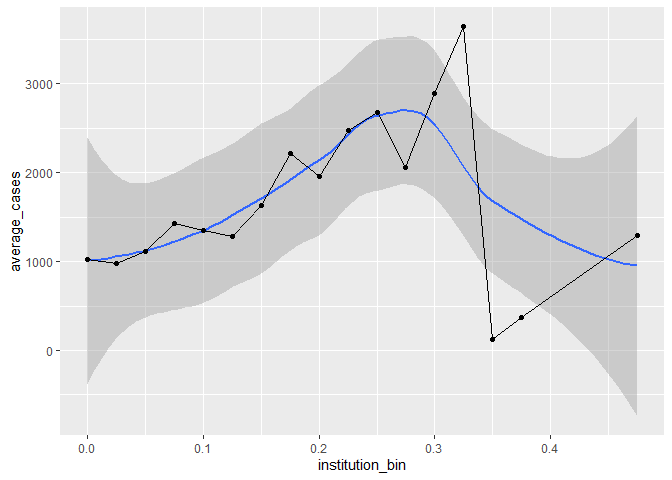
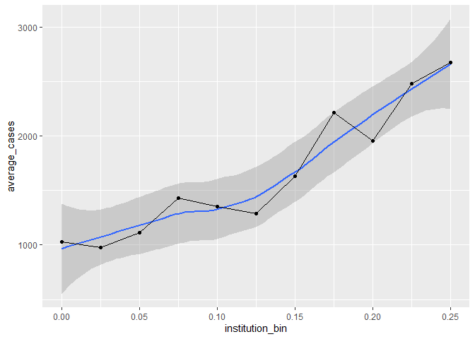
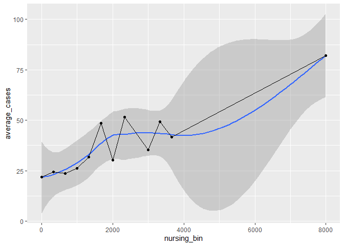
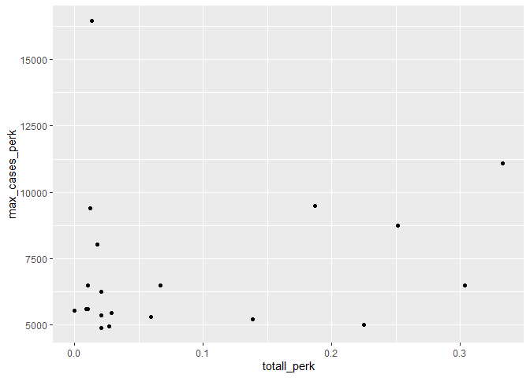
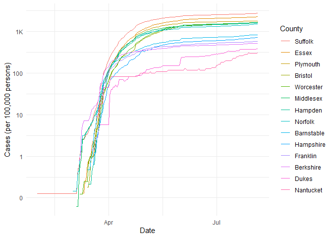

COVID-19
================
(Your name here)
2020-

  - [Grading Rubric](#grading-rubric)
      - [Individual](#individual)
      - [Team](#team)
      - [Due Date](#due-date)
  - [The Big Picture](#the-big-picture)
  - [Get the Data](#get-the-data)
      - [Navigating the Census Bureau](#navigating-the-census-bureau)
      - [Automated Download of NYT
        Data](#automated-download-of-nyt-data)
  - [Join the Data](#join-the-data)
  - [Analyze](#analyze)
      - [Normalize](#normalize)
      - [Guided EDA](#guided-eda)
      - [Self-directed EDA](#self-directed-eda)
          - [Ideas](#ideas)
          - [Aside: Some visualization
            tricks](#aside-some-visualization-tricks)
          - [Geographic exceptions](#geographic-exceptions)
  - [Notes](#notes)

*Purpose*: We can’t *possibly* do a class on data science and *not* look
at covid-19. Come on.

In this challenge, you’ll learn how to navigate the U.S. Census Bureau
website, programmatically download data from the internet, and perform a
county-level population-weighted analysis of current covid-19 trends.
Get excited\!

<!-- include-rubric -->

# Grading Rubric

<!-- -------------------------------------------------- -->

Unlike exercises, **challenges will be graded**. The following rubrics
define how you will be graded, both on an individual and team basis.

## Individual

<!-- ------------------------- -->

| Category    | Unsatisfactory                                                                   | Satisfactory                                                               |
| ----------- | -------------------------------------------------------------------------------- | -------------------------------------------------------------------------- |
| Effort      | Some task **q**’s left unattempted                                               | All task **q**’s attempted                                                 |
| Observed    | Did not document observations                                                    | Documented observations based on analysis                                  |
| Supported   | Some observations not supported by analysis                                      | All observations supported by analysis (table, graph, etc.)                |
| Code Styled | Violations of the [style guide](https://style.tidyverse.org/) hinder readability | Code sufficiently close to the [style guide](https://style.tidyverse.org/) |

## Team

<!-- ------------------------- -->

| Category   | Unsatisfactory                                                                                   | Satisfactory                                       |
| ---------- | ------------------------------------------------------------------------------------------------ | -------------------------------------------------- |
| Documented | No team contributions to Wiki                                                                    | Team contributed to Wiki                           |
| Referenced | No team references in Wiki                                                                       | At least one reference in Wiki to member report(s) |
| Relevant   | References unrelated to assertion, or difficult to find related analysis based on reference text | Reference text clearly points to relevant analysis |

## Due Date

<!-- ------------------------- -->

All the deliverables stated in the rubrics above are due on the day of
the class discussion of that exercise. See the
[Syllabus](https://docs.google.com/document/d/1jJTh2DH8nVJd2eyMMoyNGroReo0BKcJrz1eONi3rPSc/edit?usp=sharing)
for more information.

``` r
library(tidyverse)
```

    ## -- Attaching packages --------------------------------------- tidyverse 1.3.0 --

    ## v ggplot2 3.3.2     v purrr   0.3.4
    ## v tibble  3.0.1     v dplyr   1.0.0
    ## v tidyr   1.1.0     v stringr 1.4.0
    ## v readr   1.3.1     v forcats 0.5.0

    ## -- Conflicts ------------------------------------------ tidyverse_conflicts() --
    ## x dplyr::filter() masks stats::filter()
    ## x dplyr::lag()    masks stats::lag()

*Background*:
[COVID-19](https://en.wikipedia.org/wiki/Coronavirus_disease_2019) is
the disease caused by the virus SARS-CoV-2. In 2020 it became a global
pandemic, leading to huge loss of life and tremendous disruption to
society. The New York Times published up-to-date data on the progression
of the pandemic across the United States—we will study these data in
this challenge.

# The Big Picture

<!-- -------------------------------------------------- -->

We’re about to go through *a lot* of weird steps, so let’s first fix the
big picture firmly in mind:

We want to study COVID-19 in terms of data: both case counts (number of
infections) and deaths. We’re going to do a county-level analysis in
order to get a high-resolution view of the pandemic. Since US counties
can vary widely in terms of their population, we’ll need population
estimates in order to compute infection rates (think back to the
`Titanic` challenge).

That’s the high-level view; now let’s dig into the details.

# Get the Data

<!-- -------------------------------------------------- -->

1.  County-level population estimates (Census Bureau)
2.  County-level COVID-19 counts (New York Times)

## Navigating the Census Bureau

<!-- ------------------------- -->

**Steps**: Our objective is to find the 2018 American Community
Survey\[1\] (ACS) Total Population estimates, disaggregated by counties.
To check your results, this is Table `B01003`.

1.  Go to [data.census.gov](data.census.gov).
2.  Scroll down and click `View Tables`.
3.  Apply filters to find the ACS Total Population estimates,
    disaggregated by counties. I used the filters:

<!-- end list -->

  - `Topics > Populations and People > Counts, Estimates, and
    Projections > Population Total`
  - `Geography > County > All counties in United States`

<!-- end list -->

5.  Click the `Download` button to download the data; make sure to
    select the 2018 y-year estimates.
6.  Unzip and move the data to your `challenges/data` folder.

<!-- end list -->

  - Note that the data will have the crazy-long filename
    `ACSDT5Y2018.B01003_data_with_overlays_2020-06-30T102151.csv`.
    That’s because metadata is stored in the filename, such as the
    year of the estimate (`Y2018`) and my access date (`2020-06-30`).

**q1** Load Table `B01003` into the following tibble. Make sure the
column names are `id, Geographic Area Name, Estimate!!Total, Margin of
Error!!Total`.

*Hint*: You will need to use the `skip` keyword when loading these
data\!

``` r
## TASK: Load the census bureau data with the following tibble name.
df_pop  <-  read_csv("data/ACSST5Y2018.S0101_data_with_overlays_2020-08-01T094026.csv",skip = 1)  
```

    ## Parsed with column specification:
    ## cols(
    ##   .default = col_double(),
    ##   id = col_character(),
    ##   Geographic_Area_Name = col_character(),
    ##   `Margin of Error!!Total MOE!!Total population` = col_character(),
    ##   `Estimate!!Percent!!Total population` = col_character(),
    ##   `Margin of Error!!Percent MOE!!Total population` = col_character(),
    ##   `Margin of Error!!Male MOE!!Total population` = col_character(),
    ##   `Estimate!!Percent Male!!Total population` = col_character(),
    ##   `Margin of Error!!Percent Male MOE!!Total population` = col_character(),
    ##   `Margin of Error!!Female MOE!!Total population` = col_character(),
    ##   `Estimate!!Percent Female!!Total population` = col_character(),
    ##   `Margin of Error!!Percent Female MOE!!Total population` = col_character(),
    ##   `Margin of Error!!Total MOE!!Total population!!AGE!!Under 5 years` = col_character(),
    ##   `Margin of Error!!Percent MOE!!Total population!!AGE!!Under 5 years` = col_character(),
    ##   `Margin of Error!!Male MOE!!Total population!!AGE!!Under 5 years` = col_character(),
    ##   `Margin of Error!!Percent Male MOE!!Total population!!AGE!!Under 5 years` = col_character(),
    ##   `Margin of Error!!Female MOE!!Total population!!AGE!!Under 5 years` = col_character(),
    ##   `Margin of Error!!Percent Female MOE!!Total population!!AGE!!Under 5 years` = col_character(),
    ##   `Margin of Error!!Total MOE!!Total population!!AGE!!15 to 19 years` = col_character(),
    ##   `Margin of Error!!Percent MOE!!Total population!!AGE!!15 to 19 years` = col_character(),
    ##   `Margin of Error!!Male MOE!!Total population!!AGE!!15 to 19 years` = col_character()
    ##   # ... with 153 more columns
    ## )

    ## See spec(...) for full column specifications.

``` r
df_pop_select <- df_pop %>% 
  select(id,Geographic_Area_Name, EstimatePopulation) %>% 
  separate(
    col = 2,
    into = c("county", NA, "state"),
    sep = " "
  )
```

    ## Warning: Expected 3 pieces. Additional pieces discarded in 722 rows [58, 68, 69,
    ## 71, 72, 74, 75, 77, 78, 79, 80, 81, 82, 83, 85, 86, 87, 89, 90, 92, ...].

    ## Warning: Expected 3 pieces. Missing pieces filled with `NA` in 1 rows [3221].

``` r
df_pop_select
```

    ## # A tibble: 3,221 x 4
    ##    id             county   state   EstimatePopulation
    ##    <chr>          <chr>    <chr>                <dbl>
    ##  1 0500000US01001 Autauga  Alabama              55200
    ##  2 0500000US01003 Baldwin  Alabama             208107
    ##  3 0500000US01005 Barbour  Alabama              25782
    ##  4 0500000US01007 Bibb     Alabama              22527
    ##  5 0500000US01009 Blount   Alabama              57645
    ##  6 0500000US01011 Bullock  Alabama              10352
    ##  7 0500000US01013 Butler   Alabama              20025
    ##  8 0500000US01015 Calhoun  Alabama             115098
    ##  9 0500000US01017 Chambers Alabama              33826
    ## 10 0500000US01019 Cherokee Alabama              25853
    ## # ... with 3,211 more rows

*Note*: You can find information on 1-year, 3-year, and 5-year estimates
[here](https://www.census.gov/programs-surveys/acs/guidance/estimates.html).
The punchline is that 5-year estimates are more reliable but less
current.

## Automated Download of NYT Data

<!-- ------------------------- -->

ACS 5-year estimates don’t change all that often, but the COVID-19 data
are changing rapidly. To that end, it would be nice to be able to
*programmatically* download the most recent data for analysis; that way
we can update our analysis whenever we want simply by re-running our
notebook. This next problem will have you set up such a pipeline.

The New York Times is publishing up-to-date data on COVID-19 on
[GitHub](https://github.com/nytimes/covid-19-data).

**q2** Visit the NYT [GitHub](https://github.com/nytimes/covid-19-data)
repo and find the URL for the **raw** US County-level data. Assign that
URL as a string to the variable below.

``` r
## TASK: Find the URL for the NYT covid-19 county-level data
url_counties <- "https://raw.githubusercontent.com/nytimes/covid-19-data/master/us-counties.csv"
```

Once you have the url, the following code will download a local copy of
the data, then load the data into R.

``` r
## NOTE: No need to change this; just execute
## Set the filename of the data to download
filename_nyt <- "./data/nyt_counties.csv"

## Download the data locally
curl::curl_download(
        url_counties,
        destfile = filename_nyt
      )

## Loads the downloaded csv
df_covid <- read_csv(filename_nyt)
```

    ## Parsed with column specification:
    ## cols(
    ##   date = col_date(format = ""),
    ##   county = col_character(),
    ##   state = col_character(),
    ##   fips = col_character(),
    ##   cases = col_double(),
    ##   deaths = col_double()
    ## )

You can now re-run the chunk above (or the entire notebook) to pull the
most recent version of the data. Thus you can periodically re-run this
notebook to check in on the pandemic as it evolves.

*Note*: You should feel free to copy-paste the code above for your own
future projects\!

# Join the Data

<!-- -------------------------------------------------- -->

To get a sense of our task, let’s take a glimpse at our two data
sources.

``` r
## NOTE: No need to change this; just execute
df_pop_select %>% glimpse
```

    ## Rows: 3,221
    ## Columns: 4
    ## $ id                 <chr> "0500000US01001", "0500000US01003", "0500000US01...
    ## $ county             <chr> "Autauga", "Baldwin", "Barbour", "Bibb", "Blount...
    ## $ state              <chr> "Alabama", "Alabama", "Alabama", "Alabama", "Ala...
    ## $ EstimatePopulation <dbl> 55200, 208107, 25782, 22527, 57645, 10352, 20025...

``` r
df_covid %>% glimpse
```

    ## Rows: 405,287
    ## Columns: 6
    ## $ date   <date> 2020-01-21, 2020-01-22, 2020-01-23, 2020-01-24, 2020-01-24,...
    ## $ county <chr> "Snohomish", "Snohomish", "Snohomish", "Cook", "Snohomish", ...
    ## $ state  <chr> "Washington", "Washington", "Washington", "Illinois", "Washi...
    ## $ fips   <chr> "53061", "53061", "53061", "17031", "53061", "06059", "17031...
    ## $ cases  <dbl> 1, 1, 1, 1, 1, 1, 1, 1, 1, 1, 1, 1, 1, 1, 1, 1, 1, 1, 1, 1, ...
    ## $ deaths <dbl> 0, 0, 0, 0, 0, 0, 0, 0, 0, 0, 0, 0, 0, 0, 0, 0, 0, 0, 0, 0, ...

To join these datasets, we’ll need to use [FIPS county
codes](https://en.wikipedia.org/wiki/FIPS_county_code).\[2\] The last
`5` digits of the `id` column in `df_pop` is the FIPS county code, while
the NYT data `df_covid` already contains the `fips`.

**q3** Process the `id` column of `df_pop` to create a `fips` column.

``` r
## TASK: Create a `fips` column by extracting the county code
df_q3 <- df_pop_select %>% 
  mutate(fips = substr(id,10,15))

df_q3
```

    ## # A tibble: 3,221 x 5
    ##    id             county   state   EstimatePopulation fips 
    ##    <chr>          <chr>    <chr>                <dbl> <chr>
    ##  1 0500000US01001 Autauga  Alabama              55200 01001
    ##  2 0500000US01003 Baldwin  Alabama             208107 01003
    ##  3 0500000US01005 Barbour  Alabama              25782 01005
    ##  4 0500000US01007 Bibb     Alabama              22527 01007
    ##  5 0500000US01009 Blount   Alabama              57645 01009
    ##  6 0500000US01011 Bullock  Alabama              10352 01011
    ##  7 0500000US01013 Butler   Alabama              20025 01013
    ##  8 0500000US01015 Calhoun  Alabama             115098 01015
    ##  9 0500000US01017 Chambers Alabama              33826 01017
    ## 10 0500000US01019 Cherokee Alabama              25853 01019
    ## # ... with 3,211 more rows

``` r
df_q3 %>%
  filter(county == "Autauga") %>%
  pull(fips) == "01001"
```

    ## [1] TRUE

Use the following test to check your answer.

``` r
## NOTE: No need to change this
## Check known county
assertthat::assert_that(
              (df_q3 %>%
              filter(county == "Autauga") %>%
              pull(fips)) == "01001"
              )
```

    ## [1] TRUE

``` r
print("Very good!")
```

    ## [1] "Very good!"

``` r
df_q3
```

    ## # A tibble: 3,221 x 5
    ##    id             county   state   EstimatePopulation fips 
    ##    <chr>          <chr>    <chr>                <dbl> <chr>
    ##  1 0500000US01001 Autauga  Alabama              55200 01001
    ##  2 0500000US01003 Baldwin  Alabama             208107 01003
    ##  3 0500000US01005 Barbour  Alabama              25782 01005
    ##  4 0500000US01007 Bibb     Alabama              22527 01007
    ##  5 0500000US01009 Blount   Alabama              57645 01009
    ##  6 0500000US01011 Bullock  Alabama              10352 01011
    ##  7 0500000US01013 Butler   Alabama              20025 01013
    ##  8 0500000US01015 Calhoun  Alabama             115098 01015
    ##  9 0500000US01017 Chambers Alabama              33826 01017
    ## 10 0500000US01019 Cherokee Alabama              25853 01019
    ## # ... with 3,211 more rows

**q4** Join `df_covid` with `df_q3` by the `fips` column. Use the proper
type of join to preserve all rows in `df_covid`.

``` r
## TASK: Join df_covid and df_q3 by fips.
df_q4 <- merge(df_covid, df_q3, by = c("fips","county","state")) #all.y = TRUE)

#df_q4[is.na(df_q4)] <- 0
```

``` r
df_q4 %>% 
  filter(id == "0500000US51059")
```

    ##      fips  county    state       date cases deaths             id
    ## 1   51059 Fairfax Virginia 2020-03-13     6      0 0500000US51059
    ## 2   51059 Fairfax Virginia 2020-07-01 13864    488 0500000US51059
    ## 3   51059 Fairfax Virginia 2020-05-15  7159    273 0500000US51059
    ## 4   51059 Fairfax Virginia 2020-05-12  6470    253 0500000US51059
    ## 5   51059 Fairfax Virginia 2020-07-21 14994    510 0500000US51059
    ## 6   51059 Fairfax Virginia 2020-04-23  2362     76 0500000US51059
    ## 7   51059 Fairfax Virginia 2020-04-09   690     16 0500000US51059
    ## 8   51059 Fairfax Virginia 2020-04-06   488      6 0500000US51059
    ## 9   51059 Fairfax Virginia 2020-07-19 14878    508 0500000US51059
    ## 10  51059 Fairfax Virginia 2020-07-26 15304    515 0500000US51059
    ## 11  51059 Fairfax Virginia 2020-06-19 13244    432 0500000US51059
    ## 12  51059 Fairfax Virginia 2020-06-04 11815    403 0500000US51059
    ## 13  51059 Fairfax Virginia 2020-07-28 15509    519 0500000US51059
    ## 14  51059 Fairfax Virginia 2020-08-02 15768    523 0500000US51059
    ## 15  51059 Fairfax Virginia 2020-03-20    16      0 0500000US51059
    ## 16  51059 Fairfax Virginia 2020-06-07 12455    414 0500000US51059
    ## 17  51059 Fairfax Virginia 2020-04-20  1925     59 0500000US51059
    ## 18  51059 Fairfax Virginia 2020-06-05 11904    410 0500000US51059
    ## 19  51059 Fairfax Virginia 2020-04-10   777     16 0500000US51059
    ## 20  51059 Fairfax Virginia 2020-07-14 14574    500 0500000US51059
    ## 21  51059 Fairfax Virginia 2020-07-23 15126    511 0500000US51059
    ## 22  51059 Fairfax Virginia 2020-08-04 15987    528 0500000US51059
    ## 23  51059 Fairfax Virginia 2020-05-25  9482    331 0500000US51059
    ## 24  51059 Fairfax Virginia 2020-04-25  2745     90 0500000US51059
    ## 25  51059 Fairfax Virginia 2020-08-03 15907    523 0500000US51059
    ## 26  51059 Fairfax Virginia 2020-04-11   946     16 0500000US51059
    ## 27  51059 Fairfax Virginia 2020-04-17  1476     37 0500000US51059
    ## 28  51059 Fairfax Virginia 2020-05-29 10738    378 0500000US51059
    ## 29  51059 Fairfax Virginia 2020-05-14  6951    267 0500000US51059
    ## 30  51059 Fairfax Virginia 2020-04-07   532      9 0500000US51059
    ## 31  51059 Fairfax Virginia 2020-03-17    12      0 0500000US51059
    ## 32  51059 Fairfax Virginia 2020-06-28 13778    473 0500000US51059
    ## 33  51059 Fairfax Virginia 2020-04-14  1207     20 0500000US51059
    ## 34  51059 Fairfax Virginia 2020-04-19  1809     37 0500000US51059
    ## 35  51059 Fairfax Virginia 2020-05-21  8580    309 0500000US51059
    ## 36  51059 Fairfax Virginia 2020-05-19  8020    292 0500000US51059
    ## 37  51059 Fairfax Virginia 2020-07-16 14687    509 0500000US51059
    ## 38  51059 Fairfax Virginia 2020-05-09  5610    230 0500000US51059
    ## 39  51059 Fairfax Virginia 2020-07-31 15616    520 0500000US51059
    ## 40  51059 Fairfax Virginia 2020-06-11 12812    418 0500000US51059
    ## 41  51059 Fairfax Virginia 2020-06-15 13092    423 0500000US51059
    ## 42  51059 Fairfax Virginia 2020-03-19    16      0 0500000US51059
    ## 43  51059 Fairfax Virginia 2020-07-03 13965    494 0500000US51059
    ## 44  51059 Fairfax Virginia 2020-03-30   225      2 0500000US51059
    ## 45  51059 Fairfax Virginia 2020-06-08 12603    414 0500000US51059
    ## 46  51059 Fairfax Virginia 2020-03-15    10      0 0500000US51059
    ## 47  51059 Fairfax Virginia 2020-06-26 13653    463 0500000US51059
    ## 48  51059 Fairfax Virginia 2020-07-08 14253    495 0500000US51059
    ## 49  51059 Fairfax Virginia 2020-04-08   570      9 0500000US51059
    ## 50  51059 Fairfax Virginia 2020-07-12 14482    500 0500000US51059
    ## 51  51059 Fairfax Virginia 2020-05-01  3897    137 0500000US51059
    ## 52  51059 Fairfax Virginia 2020-07-13 14556    500 0500000US51059
    ## 53  51059 Fairfax Virginia 2020-04-22  2256     66 0500000US51059
    ## 54  51059 Fairfax Virginia 2020-03-27   124      1 0500000US51059
    ## 55  51059 Fairfax Virginia 2020-07-18 14798    508 0500000US51059
    ## 56  51059 Fairfax Virginia 2020-05-27 10069    364 0500000US51059
    ## 57  51059 Fairfax Virginia 2020-07-22 15078    510 0500000US51059
    ## 58  51059 Fairfax Virginia 2020-05-16  7386    278 0500000US51059
    ## 59  51059 Fairfax Virginia 2020-04-29  3448    124 0500000US51059
    ## 60  51059 Fairfax Virginia 2020-05-31 11110    383 0500000US51059
    ## 61  51059 Fairfax Virginia 2020-06-27 13728    468 0500000US51059
    ## 62  51059 Fairfax Virginia 2020-05-24  8989    327 0500000US51059
    ## 63  51059 Fairfax Virginia 2020-04-16  1375     30 0500000US51059
    ## 64  51059 Fairfax Virginia 2020-06-17 13153    429 0500000US51059
    ## 65  51059 Fairfax Virginia 2020-06-21 13419    435 0500000US51059
    ## 66  51059 Fairfax Virginia 2020-05-18  7843    284 0500000US51059
    ## 67  51059 Fairfax Virginia 2020-05-06  4834    201 0500000US51059
    ## 68  51059 Fairfax Virginia 2020-05-11  6200    243 0500000US51059
    ## 69  51059 Fairfax Virginia 2020-03-24    46      1 0500000US51059
    ## 70  51059 Fairfax Virginia 2020-06-02 11426    391 0500000US51059
    ## 71  51059 Fairfax Virginia 2020-05-20  8163    302 0500000US51059
    ## 72  51059 Fairfax Virginia 2020-03-07     1      0 0500000US51059
    ## 73  51059 Fairfax Virginia 2020-04-24  2534     85 0500000US51059
    ## 74  51059 Fairfax Virginia 2020-05-02  4046    153 0500000US51059
    ## 75  51059 Fairfax Virginia 2020-03-25    76      1 0500000US51059
    ## 76  51059 Fairfax Virginia 2020-03-18    14      0 0500000US51059
    ## 77  51059 Fairfax Virginia 2020-06-14 13017    423 0500000US51059
    ## 78  51059 Fairfax Virginia 2020-03-26   124      1 0500000US51059
    ## 79  51059 Fairfax Virginia 2020-03-28   156      1 0500000US51059
    ## 80  51059 Fairfax Virginia 2020-04-01   288      5 0500000US51059
    ## 81  51059 Fairfax Virginia 2020-07-05 14153    496 0500000US51059
    ## 82  51059 Fairfax Virginia 2020-07-15 14653    502 0500000US51059
    ## 83  51059 Fairfax Virginia 2020-07-10 14356    499 0500000US51059
    ## 84  51059 Fairfax Virginia 2020-03-10     4      0 0500000US51059
    ## 85  51059 Fairfax Virginia 2020-05-13  6666    262 0500000US51059
    ## 86  51059 Fairfax Virginia 2020-06-10 12746    422 0500000US51059
    ## 87  51059 Fairfax Virginia 2020-07-27 15455    517 0500000US51059
    ## 88  51059 Fairfax Virginia 2020-05-08  5338    227 0500000US51059
    ## 89  51059 Fairfax Virginia 2020-06-22 13499    438 0500000US51059
    ## 90  51059 Fairfax Virginia 2020-03-29   187      1 0500000US51059
    ## 91  51059 Fairfax Virginia 2020-04-05   426      5 0500000US51059
    ## 92  51059 Fairfax Virginia 2020-06-29 13840    478 0500000US51059
    ## 93  51059 Fairfax Virginia 2020-07-20 14934    508 0500000US51059
    ## 94  51059 Fairfax Virginia 2020-03-21    22      1 0500000US51059
    ## 95  51059 Fairfax Virginia 2020-04-28  3278    114 0500000US51059
    ## 96  51059 Fairfax Virginia 2020-03-23    43      1 0500000US51059
    ## 97  51059 Fairfax Virginia 2020-05-05  4834    201 0500000US51059
    ## 98  51059 Fairfax Virginia 2020-04-27  3002    100 0500000US51059
    ## 99  51059 Fairfax Virginia 2020-04-13  1164     20 0500000US51059
    ## 100 51059 Fairfax Virginia 2020-05-26  9839    340 0500000US51059
    ## 101 51059 Fairfax Virginia 2020-06-12 12863    421 0500000US51059
    ## 102 51059 Fairfax Virginia 2020-06-03 11596    396 0500000US51059
    ## 103 51059 Fairfax Virginia 2020-04-12  1008     16 0500000US51059
    ## 104 51059 Fairfax Virginia 2020-07-25 15265    515 0500000US51059
    ## 105 51059 Fairfax Virginia 2020-05-04  4615    198 0500000US51059
    ## 106 51059 Fairfax Virginia 2020-04-03   372      5 0500000US51059
    ## 107 51059 Fairfax Virginia 2020-03-31   244      2 0500000US51059
    ## 108 51059 Fairfax Virginia 2020-03-12     4      0 0500000US51059
    ## 109 51059 Fairfax Virginia 2020-06-13 12939    423 0500000US51059
    ## 110 51059 Fairfax Virginia 2020-07-07 14191    495 0500000US51059
    ## 111 51059 Fairfax Virginia 2020-07-04 14072    495 0500000US51059
    ## 112 51059 Fairfax Virginia 2020-03-22    31      1 0500000US51059
    ## 113 51059 Fairfax Virginia 2020-06-30 13850    488 0500000US51059
    ## 114 51059 Fairfax Virginia 2020-04-30  3611    134 0500000US51059
    ## 115 51059 Fairfax Virginia 2020-06-06 12056    413 0500000US51059
    ## 116 51059 Fairfax Virginia 2020-06-09 12695    416 0500000US51059
    ## 117 51059 Fairfax Virginia 2020-04-02   328      5 0500000US51059
    ## 118 51059 Fairfax Virginia 2020-05-03  4340    184 0500000US51059
    ## 119 51059 Fairfax Virginia 2020-05-22  8734    321 0500000US51059
    ## 120 51059 Fairfax Virginia 2020-04-15  1298     29 0500000US51059
    ## 121 51059 Fairfax Virginia 2020-07-17 14731    508 0500000US51059
    ## 122 51059 Fairfax Virginia 2020-07-09 14284    497 0500000US51059
    ## 123 51059 Fairfax Virginia 2020-05-07  5045    211 0500000US51059
    ## 124 51059 Fairfax Virginia 2020-04-21  2077     64 0500000US51059
    ## 125 51059 Fairfax Virginia 2020-03-08     2      0 0500000US51059
    ## 126 51059 Fairfax Virginia 2020-08-01 15689    522 0500000US51059
    ## 127 51059 Fairfax Virginia 2020-06-23 13579    445 0500000US51059
    ## 128 51059 Fairfax Virginia 2020-06-16 13103    428 0500000US51059
    ## 129 51059 Fairfax Virginia 2020-03-09     4      0 0500000US51059
    ## 130 51059 Fairfax Virginia 2020-07-06 14205    495 0500000US51059
    ## 131 51059 Fairfax Virginia 2020-05-30 10906    383 0500000US51059
    ## 132 51059 Fairfax Virginia 2020-07-02 13886    492 0500000US51059
    ## 133 51059 Fairfax Virginia 2020-08-05 16019    530 0500000US51059
    ## 134 51059 Fairfax Virginia 2020-07-11 14403    498 0500000US51059
    ## 135 51059 Fairfax Virginia 2020-04-18  1633     37 0500000US51059
    ## 136 51059 Fairfax Virginia 2020-05-17  7643    282 0500000US51059
    ## 137 51059 Fairfax Virginia 2020-05-10  5892    239 0500000US51059
    ## 138 51059 Fairfax Virginia 2020-06-18 13209    431 0500000US51059
    ## 139 51059 Fairfax Virginia 2020-05-23  8945    326 0500000US51059
    ## 140 51059 Fairfax Virginia 2020-07-24 15231    513 0500000US51059
    ## 141 51059 Fairfax Virginia 2020-07-30 15606    519 0500000US51059
    ## 142 51059 Fairfax Virginia 2020-03-11     4      0 0500000US51059
    ## 143 51059 Fairfax Virginia 2020-04-26  2889     95 0500000US51059
    ## 144 51059 Fairfax Virginia 2020-06-25 13611    457 0500000US51059
    ## 145 51059 Fairfax Virginia 2020-03-14    10      0 0500000US51059
    ## 146 51059 Fairfax Virginia 2020-03-16    10      0 0500000US51059
    ## 147 51059 Fairfax Virginia 2020-06-24 13588    450 0500000US51059
    ## 148 51059 Fairfax Virginia 2020-04-04   387      5 0500000US51059
    ## 149 51059 Fairfax Virginia 2020-07-29 15570    519 0500000US51059
    ## 150 51059 Fairfax Virginia 2020-06-01 11219    387 0500000US51059
    ## 151 51059 Fairfax Virginia 2020-05-28 10503    371 0500000US51059
    ## 152 51059 Fairfax Virginia 2020-06-20 13341    435 0500000US51059
    ##     EstimatePopulation
    ## 1              1143529
    ## 2              1143529
    ## 3              1143529
    ## 4              1143529
    ## 5              1143529
    ## 6              1143529
    ## 7              1143529
    ## 8              1143529
    ## 9              1143529
    ## 10             1143529
    ## 11             1143529
    ## 12             1143529
    ## 13             1143529
    ## 14             1143529
    ## 15             1143529
    ## 16             1143529
    ## 17             1143529
    ## 18             1143529
    ## 19             1143529
    ## 20             1143529
    ## 21             1143529
    ## 22             1143529
    ## 23             1143529
    ## 24             1143529
    ## 25             1143529
    ## 26             1143529
    ## 27             1143529
    ## 28             1143529
    ## 29             1143529
    ## 30             1143529
    ## 31             1143529
    ## 32             1143529
    ## 33             1143529
    ## 34             1143529
    ## 35             1143529
    ## 36             1143529
    ## 37             1143529
    ## 38             1143529
    ## 39             1143529
    ## 40             1143529
    ## 41             1143529
    ## 42             1143529
    ## 43             1143529
    ## 44             1143529
    ## 45             1143529
    ## 46             1143529
    ## 47             1143529
    ## 48             1143529
    ## 49             1143529
    ## 50             1143529
    ## 51             1143529
    ## 52             1143529
    ## 53             1143529
    ## 54             1143529
    ## 55             1143529
    ## 56             1143529
    ## 57             1143529
    ## 58             1143529
    ## 59             1143529
    ## 60             1143529
    ## 61             1143529
    ## 62             1143529
    ## 63             1143529
    ## 64             1143529
    ## 65             1143529
    ## 66             1143529
    ## 67             1143529
    ## 68             1143529
    ## 69             1143529
    ## 70             1143529
    ## 71             1143529
    ## 72             1143529
    ## 73             1143529
    ## 74             1143529
    ## 75             1143529
    ## 76             1143529
    ## 77             1143529
    ## 78             1143529
    ## 79             1143529
    ## 80             1143529
    ## 81             1143529
    ## 82             1143529
    ## 83             1143529
    ## 84             1143529
    ## 85             1143529
    ## 86             1143529
    ## 87             1143529
    ## 88             1143529
    ## 89             1143529
    ## 90             1143529
    ## 91             1143529
    ## 92             1143529
    ## 93             1143529
    ## 94             1143529
    ## 95             1143529
    ## 96             1143529
    ## 97             1143529
    ## 98             1143529
    ## 99             1143529
    ## 100            1143529
    ## 101            1143529
    ## 102            1143529
    ## 103            1143529
    ## 104            1143529
    ## 105            1143529
    ## 106            1143529
    ## 107            1143529
    ## 108            1143529
    ## 109            1143529
    ## 110            1143529
    ## 111            1143529
    ## 112            1143529
    ## 113            1143529
    ## 114            1143529
    ## 115            1143529
    ## 116            1143529
    ## 117            1143529
    ## 118            1143529
    ## 119            1143529
    ## 120            1143529
    ## 121            1143529
    ## 122            1143529
    ## 123            1143529
    ## 124            1143529
    ## 125            1143529
    ## 126            1143529
    ## 127            1143529
    ## 128            1143529
    ## 129            1143529
    ## 130            1143529
    ## 131            1143529
    ## 132            1143529
    ## 133            1143529
    ## 134            1143529
    ## 135            1143529
    ## 136            1143529
    ## 137            1143529
    ## 138            1143529
    ## 139            1143529
    ## 140            1143529
    ## 141            1143529
    ## 142            1143529
    ## 143            1143529
    ## 144            1143529
    ## 145            1143529
    ## 146            1143529
    ## 147            1143529
    ## 148            1143529
    ## 149            1143529
    ## 150            1143529
    ## 151            1143529
    ## 152            1143529

``` r
df_q4 %>% 
  filter(county == "Fairfax") %>% 
  arrange(date)
```

    ##      fips  county    state       date cases deaths             id
    ## 1   51059 Fairfax Virginia 2020-03-07     1      0 0500000US51059
    ## 2   51059 Fairfax Virginia 2020-03-08     2      0 0500000US51059
    ## 3   51059 Fairfax Virginia 2020-03-09     4      0 0500000US51059
    ## 4   51059 Fairfax Virginia 2020-03-10     4      0 0500000US51059
    ## 5   51059 Fairfax Virginia 2020-03-11     4      0 0500000US51059
    ## 6   51059 Fairfax Virginia 2020-03-12     4      0 0500000US51059
    ## 7   51059 Fairfax Virginia 2020-03-13     6      0 0500000US51059
    ## 8   51059 Fairfax Virginia 2020-03-14    10      0 0500000US51059
    ## 9   51059 Fairfax Virginia 2020-03-15    10      0 0500000US51059
    ## 10  51059 Fairfax Virginia 2020-03-16    10      0 0500000US51059
    ## 11  51059 Fairfax Virginia 2020-03-17    12      0 0500000US51059
    ## 12  51059 Fairfax Virginia 2020-03-18    14      0 0500000US51059
    ## 13  51059 Fairfax Virginia 2020-03-19    16      0 0500000US51059
    ## 14  51059 Fairfax Virginia 2020-03-20    16      0 0500000US51059
    ## 15  51059 Fairfax Virginia 2020-03-21    22      1 0500000US51059
    ## 16  51059 Fairfax Virginia 2020-03-22    31      1 0500000US51059
    ## 17  51059 Fairfax Virginia 2020-03-23    43      1 0500000US51059
    ## 18  51059 Fairfax Virginia 2020-03-24    46      1 0500000US51059
    ## 19  51059 Fairfax Virginia 2020-03-25    76      1 0500000US51059
    ## 20  51059 Fairfax Virginia 2020-03-26   124      1 0500000US51059
    ## 21  51059 Fairfax Virginia 2020-03-27   124      1 0500000US51059
    ## 22  51059 Fairfax Virginia 2020-03-28   156      1 0500000US51059
    ## 23  51059 Fairfax Virginia 2020-03-29   187      1 0500000US51059
    ## 24  51059 Fairfax Virginia 2020-03-30   225      2 0500000US51059
    ## 25  51059 Fairfax Virginia 2020-03-31   244      2 0500000US51059
    ## 26  51059 Fairfax Virginia 2020-04-01   288      5 0500000US51059
    ## 27  51059 Fairfax Virginia 2020-04-02   328      5 0500000US51059
    ## 28  51059 Fairfax Virginia 2020-04-03   372      5 0500000US51059
    ## 29  51059 Fairfax Virginia 2020-04-04   387      5 0500000US51059
    ## 30  51059 Fairfax Virginia 2020-04-05   426      5 0500000US51059
    ## 31  51059 Fairfax Virginia 2020-04-06   488      6 0500000US51059
    ## 32  51059 Fairfax Virginia 2020-04-07   532      9 0500000US51059
    ## 33  51059 Fairfax Virginia 2020-04-08   570      9 0500000US51059
    ## 34  51059 Fairfax Virginia 2020-04-09   690     16 0500000US51059
    ## 35  51059 Fairfax Virginia 2020-04-10   777     16 0500000US51059
    ## 36  51059 Fairfax Virginia 2020-04-11   946     16 0500000US51059
    ## 37  51059 Fairfax Virginia 2020-04-12  1008     16 0500000US51059
    ## 38  51059 Fairfax Virginia 2020-04-13  1164     20 0500000US51059
    ## 39  51059 Fairfax Virginia 2020-04-14  1207     20 0500000US51059
    ## 40  51059 Fairfax Virginia 2020-04-15  1298     29 0500000US51059
    ## 41  51059 Fairfax Virginia 2020-04-16  1375     30 0500000US51059
    ## 42  51059 Fairfax Virginia 2020-04-17  1476     37 0500000US51059
    ## 43  51059 Fairfax Virginia 2020-04-18  1633     37 0500000US51059
    ## 44  51059 Fairfax Virginia 2020-04-19  1809     37 0500000US51059
    ## 45  51059 Fairfax Virginia 2020-04-20  1925     59 0500000US51059
    ## 46  51059 Fairfax Virginia 2020-04-21  2077     64 0500000US51059
    ## 47  51059 Fairfax Virginia 2020-04-22  2256     66 0500000US51059
    ## 48  51059 Fairfax Virginia 2020-04-23  2362     76 0500000US51059
    ## 49  51059 Fairfax Virginia 2020-04-24  2534     85 0500000US51059
    ## 50  51059 Fairfax Virginia 2020-04-25  2745     90 0500000US51059
    ## 51  51059 Fairfax Virginia 2020-04-26  2889     95 0500000US51059
    ## 52  51059 Fairfax Virginia 2020-04-27  3002    100 0500000US51059
    ## 53  51059 Fairfax Virginia 2020-04-28  3278    114 0500000US51059
    ## 54  51059 Fairfax Virginia 2020-04-29  3448    124 0500000US51059
    ## 55  51059 Fairfax Virginia 2020-04-30  3611    134 0500000US51059
    ## 56  51059 Fairfax Virginia 2020-05-01  3897    137 0500000US51059
    ## 57  51059 Fairfax Virginia 2020-05-02  4046    153 0500000US51059
    ## 58  51059 Fairfax Virginia 2020-05-03  4340    184 0500000US51059
    ## 59  51059 Fairfax Virginia 2020-05-04  4615    198 0500000US51059
    ## 60  51059 Fairfax Virginia 2020-05-05  4834    201 0500000US51059
    ## 61  51059 Fairfax Virginia 2020-05-06  4834    201 0500000US51059
    ## 62  51059 Fairfax Virginia 2020-05-07  5045    211 0500000US51059
    ## 63  51059 Fairfax Virginia 2020-05-08  5338    227 0500000US51059
    ## 64  51059 Fairfax Virginia 2020-05-09  5610    230 0500000US51059
    ## 65  51059 Fairfax Virginia 2020-05-10  5892    239 0500000US51059
    ## 66  51059 Fairfax Virginia 2020-05-11  6200    243 0500000US51059
    ## 67  51059 Fairfax Virginia 2020-05-12  6470    253 0500000US51059
    ## 68  51059 Fairfax Virginia 2020-05-13  6666    262 0500000US51059
    ## 69  51059 Fairfax Virginia 2020-05-14  6951    267 0500000US51059
    ## 70  51059 Fairfax Virginia 2020-05-15  7159    273 0500000US51059
    ## 71  51059 Fairfax Virginia 2020-05-16  7386    278 0500000US51059
    ## 72  51059 Fairfax Virginia 2020-05-17  7643    282 0500000US51059
    ## 73  51059 Fairfax Virginia 2020-05-18  7843    284 0500000US51059
    ## 74  51059 Fairfax Virginia 2020-05-19  8020    292 0500000US51059
    ## 75  51059 Fairfax Virginia 2020-05-20  8163    302 0500000US51059
    ## 76  51059 Fairfax Virginia 2020-05-21  8580    309 0500000US51059
    ## 77  51059 Fairfax Virginia 2020-05-22  8734    321 0500000US51059
    ## 78  51059 Fairfax Virginia 2020-05-23  8945    326 0500000US51059
    ## 79  51059 Fairfax Virginia 2020-05-24  8989    327 0500000US51059
    ## 80  51059 Fairfax Virginia 2020-05-25  9482    331 0500000US51059
    ## 81  51059 Fairfax Virginia 2020-05-26  9839    340 0500000US51059
    ## 82  51059 Fairfax Virginia 2020-05-27 10069    364 0500000US51059
    ## 83  51059 Fairfax Virginia 2020-05-28 10503    371 0500000US51059
    ## 84  51059 Fairfax Virginia 2020-05-29 10738    378 0500000US51059
    ## 85  51059 Fairfax Virginia 2020-05-30 10906    383 0500000US51059
    ## 86  51059 Fairfax Virginia 2020-05-31 11110    383 0500000US51059
    ## 87  51059 Fairfax Virginia 2020-06-01 11219    387 0500000US51059
    ## 88  51059 Fairfax Virginia 2020-06-02 11426    391 0500000US51059
    ## 89  51059 Fairfax Virginia 2020-06-03 11596    396 0500000US51059
    ## 90  51059 Fairfax Virginia 2020-06-04 11815    403 0500000US51059
    ## 91  51059 Fairfax Virginia 2020-06-05 11904    410 0500000US51059
    ## 92  51059 Fairfax Virginia 2020-06-06 12056    413 0500000US51059
    ## 93  51059 Fairfax Virginia 2020-06-07 12455    414 0500000US51059
    ## 94  51059 Fairfax Virginia 2020-06-08 12603    414 0500000US51059
    ## 95  51059 Fairfax Virginia 2020-06-09 12695    416 0500000US51059
    ## 96  51059 Fairfax Virginia 2020-06-10 12746    422 0500000US51059
    ## 97  51059 Fairfax Virginia 2020-06-11 12812    418 0500000US51059
    ## 98  51059 Fairfax Virginia 2020-06-12 12863    421 0500000US51059
    ## 99  51059 Fairfax Virginia 2020-06-13 12939    423 0500000US51059
    ## 100 51059 Fairfax Virginia 2020-06-14 13017    423 0500000US51059
    ## 101 51059 Fairfax Virginia 2020-06-15 13092    423 0500000US51059
    ## 102 51059 Fairfax Virginia 2020-06-16 13103    428 0500000US51059
    ## 103 51059 Fairfax Virginia 2020-06-17 13153    429 0500000US51059
    ## 104 51059 Fairfax Virginia 2020-06-18 13209    431 0500000US51059
    ## 105 51059 Fairfax Virginia 2020-06-19 13244    432 0500000US51059
    ## 106 51059 Fairfax Virginia 2020-06-20 13341    435 0500000US51059
    ## 107 51059 Fairfax Virginia 2020-06-21 13419    435 0500000US51059
    ## 108 51059 Fairfax Virginia 2020-06-22 13499    438 0500000US51059
    ## 109 51059 Fairfax Virginia 2020-06-23 13579    445 0500000US51059
    ## 110 51059 Fairfax Virginia 2020-06-24 13588    450 0500000US51059
    ## 111 51059 Fairfax Virginia 2020-06-25 13611    457 0500000US51059
    ## 112 51059 Fairfax Virginia 2020-06-26 13653    463 0500000US51059
    ## 113 51059 Fairfax Virginia 2020-06-27 13728    468 0500000US51059
    ## 114 51059 Fairfax Virginia 2020-06-28 13778    473 0500000US51059
    ## 115 51059 Fairfax Virginia 2020-06-29 13840    478 0500000US51059
    ## 116 51059 Fairfax Virginia 2020-06-30 13850    488 0500000US51059
    ## 117 51059 Fairfax Virginia 2020-07-01 13864    488 0500000US51059
    ## 118 51059 Fairfax Virginia 2020-07-02 13886    492 0500000US51059
    ## 119 51059 Fairfax Virginia 2020-07-03 13965    494 0500000US51059
    ## 120 51059 Fairfax Virginia 2020-07-04 14072    495 0500000US51059
    ## 121 51059 Fairfax Virginia 2020-07-05 14153    496 0500000US51059
    ## 122 51059 Fairfax Virginia 2020-07-06 14205    495 0500000US51059
    ## 123 51059 Fairfax Virginia 2020-07-07 14191    495 0500000US51059
    ## 124 51059 Fairfax Virginia 2020-07-08 14253    495 0500000US51059
    ## 125 51059 Fairfax Virginia 2020-07-09 14284    497 0500000US51059
    ## 126 51059 Fairfax Virginia 2020-07-10 14356    499 0500000US51059
    ## 127 51059 Fairfax Virginia 2020-07-11 14403    498 0500000US51059
    ## 128 51059 Fairfax Virginia 2020-07-12 14482    500 0500000US51059
    ## 129 51059 Fairfax Virginia 2020-07-13 14556    500 0500000US51059
    ## 130 51059 Fairfax Virginia 2020-07-14 14574    500 0500000US51059
    ## 131 51059 Fairfax Virginia 2020-07-15 14653    502 0500000US51059
    ## 132 51059 Fairfax Virginia 2020-07-16 14687    509 0500000US51059
    ## 133 51059 Fairfax Virginia 2020-07-17 14731    508 0500000US51059
    ## 134 51059 Fairfax Virginia 2020-07-18 14798    508 0500000US51059
    ## 135 51059 Fairfax Virginia 2020-07-19 14878    508 0500000US51059
    ## 136 51059 Fairfax Virginia 2020-07-20 14934    508 0500000US51059
    ## 137 51059 Fairfax Virginia 2020-07-21 14994    510 0500000US51059
    ## 138 51059 Fairfax Virginia 2020-07-22 15078    510 0500000US51059
    ## 139 51059 Fairfax Virginia 2020-07-23 15126    511 0500000US51059
    ## 140 51059 Fairfax Virginia 2020-07-24 15231    513 0500000US51059
    ## 141 51059 Fairfax Virginia 2020-07-25 15265    515 0500000US51059
    ## 142 51059 Fairfax Virginia 2020-07-26 15304    515 0500000US51059
    ## 143 51059 Fairfax Virginia 2020-07-27 15455    517 0500000US51059
    ## 144 51059 Fairfax Virginia 2020-07-28 15509    519 0500000US51059
    ## 145 51059 Fairfax Virginia 2020-07-29 15570    519 0500000US51059
    ## 146 51059 Fairfax Virginia 2020-07-30 15606    519 0500000US51059
    ## 147 51059 Fairfax Virginia 2020-07-31 15616    520 0500000US51059
    ## 148 51059 Fairfax Virginia 2020-08-01 15689    522 0500000US51059
    ## 149 51059 Fairfax Virginia 2020-08-02 15768    523 0500000US51059
    ## 150 51059 Fairfax Virginia 2020-08-03 15907    523 0500000US51059
    ## 151 51059 Fairfax Virginia 2020-08-04 15987    528 0500000US51059
    ## 152 51059 Fairfax Virginia 2020-08-05 16019    530 0500000US51059
    ##     EstimatePopulation
    ## 1              1143529
    ## 2              1143529
    ## 3              1143529
    ## 4              1143529
    ## 5              1143529
    ## 6              1143529
    ## 7              1143529
    ## 8              1143529
    ## 9              1143529
    ## 10             1143529
    ## 11             1143529
    ## 12             1143529
    ## 13             1143529
    ## 14             1143529
    ## 15             1143529
    ## 16             1143529
    ## 17             1143529
    ## 18             1143529
    ## 19             1143529
    ## 20             1143529
    ## 21             1143529
    ## 22             1143529
    ## 23             1143529
    ## 24             1143529
    ## 25             1143529
    ## 26             1143529
    ## 27             1143529
    ## 28             1143529
    ## 29             1143529
    ## 30             1143529
    ## 31             1143529
    ## 32             1143529
    ## 33             1143529
    ## 34             1143529
    ## 35             1143529
    ## 36             1143529
    ## 37             1143529
    ## 38             1143529
    ## 39             1143529
    ## 40             1143529
    ## 41             1143529
    ## 42             1143529
    ## 43             1143529
    ## 44             1143529
    ## 45             1143529
    ## 46             1143529
    ## 47             1143529
    ## 48             1143529
    ## 49             1143529
    ## 50             1143529
    ## 51             1143529
    ## 52             1143529
    ## 53             1143529
    ## 54             1143529
    ## 55             1143529
    ## 56             1143529
    ## 57             1143529
    ## 58             1143529
    ## 59             1143529
    ## 60             1143529
    ## 61             1143529
    ## 62             1143529
    ## 63             1143529
    ## 64             1143529
    ## 65             1143529
    ## 66             1143529
    ## 67             1143529
    ## 68             1143529
    ## 69             1143529
    ## 70             1143529
    ## 71             1143529
    ## 72             1143529
    ## 73             1143529
    ## 74             1143529
    ## 75             1143529
    ## 76             1143529
    ## 77             1143529
    ## 78             1143529
    ## 79             1143529
    ## 80             1143529
    ## 81             1143529
    ## 82             1143529
    ## 83             1143529
    ## 84             1143529
    ## 85             1143529
    ## 86             1143529
    ## 87             1143529
    ## 88             1143529
    ## 89             1143529
    ## 90             1143529
    ## 91             1143529
    ## 92             1143529
    ## 93             1143529
    ## 94             1143529
    ## 95             1143529
    ## 96             1143529
    ## 97             1143529
    ## 98             1143529
    ## 99             1143529
    ## 100            1143529
    ## 101            1143529
    ## 102            1143529
    ## 103            1143529
    ## 104            1143529
    ## 105            1143529
    ## 106            1143529
    ## 107            1143529
    ## 108            1143529
    ## 109            1143529
    ## 110            1143529
    ## 111            1143529
    ## 112            1143529
    ## 113            1143529
    ## 114            1143529
    ## 115            1143529
    ## 116            1143529
    ## 117            1143529
    ## 118            1143529
    ## 119            1143529
    ## 120            1143529
    ## 121            1143529
    ## 122            1143529
    ## 123            1143529
    ## 124            1143529
    ## 125            1143529
    ## 126            1143529
    ## 127            1143529
    ## 128            1143529
    ## 129            1143529
    ## 130            1143529
    ## 131            1143529
    ## 132            1143529
    ## 133            1143529
    ## 134            1143529
    ## 135            1143529
    ## 136            1143529
    ## 137            1143529
    ## 138            1143529
    ## 139            1143529
    ## 140            1143529
    ## 141            1143529
    ## 142            1143529
    ## 143            1143529
    ## 144            1143529
    ## 145            1143529
    ## 146            1143529
    ## 147            1143529
    ## 148            1143529
    ## 149            1143529
    ## 150            1143529
    ## 151            1143529
    ## 152            1143529

For convenience, I down-select some columns and produce more convenient
column names.

``` r
## NOTE: No need to change; run this to produce a more convenient tibble
df_data <-
  df_q4 %>%
  select(
    date,
    county,
    state,
    fips,
    cases,
    deaths,
    population = `EstimatePopulation`
  )
```

# Analyze

<!-- -------------------------------------------------- -->

Now that we’ve done the hard work of loading and wrangling the data, we
can finally start our analysis. Our first step will be to produce county
population-normalized cases and death counts. Then we will explore the
data.

## Normalize

<!-- ------------------------- -->

**q5** Use the `population` estimates in `df_data` to normalize `cases`
and `deaths` to produce per 100,000 counts.\[3\] Store these values in
the columns `cases_perk` and `deaths_perk`.

``` r
## TASK: Normalize cases and deaths
df_normalized <-
  df_data %>% 
  mutate(cases_perk = cases/(population/100000), deaths_perk = deaths/(population/100000)) 
```

You may use the following test to check your work.

``` r
## NOTE: No need to change this
## Check known county data
assertthat::assert_that(
              abs(df_normalized %>%
               filter(str_detect(county, "Snohomish"),
                 date == "2020-01-21"
               ) %>%
              pull(cases_perk) - 0.127) < 1e-3
            )
```

    ## [1] TRUE

``` r
assertthat::assert_that(
              abs(df_normalized %>%
               filter(
                 str_detect(county, "Snohomish"),
                 date == "2020-01-21"
               ) %>%
              pull(deaths_perk) - 0) < 1e-3
            )
```

    ## [1] TRUE

``` r
print("Excellent!")
```

    ## [1] "Excellent!"

## Guided EDA

<!-- ------------------------- -->

Before turning you loose, let’s complete a couple guided EDA tasks.

**q6** Compute the mean and standard deviation for `cases_perk` and
`deaths_perk`.

``` r
df_normalized %>% 
  summarise(mean_cases = mean(cases_perk), sd_cases = sd(cases_perk), mean_deaths = mean(deaths_perk), sd_deaths = sd(deaths_perk))
```

    ##   mean_cases sd_cases mean_deaths sd_deaths
    ## 1   390.4397 717.5317    11.90374  26.20997

**q7** Find the top 10 counties in terms of `cases_perk`, and the top 10
in terms of `deaths_perk`. Report the population of each county along
with the per-100,000 counts. Compare the counts against the mean values
you found in q6. Note any observations. Does New York City show up in
the top? Why or why not?

``` r
## TASK: Find the top 10 max cases_perk counties; report populations as well
df_normalized %>% 
  group_by(county,state) %>% 
  summarise(max_cases_perk = max(cases_perk), population = max(population)) %>% 
  ungroup() %>% 
  arrange(desc(max_cases_perk)) %>% 
  head(10)
```

    ## `summarise()` regrouping output by 'county' (override with `.groups` argument)

    ## # A tibble: 10 x 4
    ##    county        state     max_cases_perk population
    ##    <chr>         <chr>              <dbl>      <dbl>
    ##  1 Trousdale     Tennessee         16463.       9573
    ##  2 Lake          Tennessee         11095.       7526
    ##  3 Lee           Arkansas           9470.       9398
    ##  4 Dakota        Nebraska           9391.      20317
    ##  5 Lincoln       Arkansas           8733.      13695
    ##  6 Nobles        Minnesota          8018.      21839
    ##  7 Colfax        Nebraska           6468.      10760
    ##  8 Chicot        Arkansas           6466.      10826
    ##  9 Chattahoochee Georgia            6464.      10767
    ## 10 Ford          Kansas             6226.      34484

``` r
#df_data %>% 
#  filter(county == "Fairfax") %>% 
#  arrange(date)

## TASK: Find the top 10 deaths_perk counties; report populations as well
```

**Observations**:

New York is not on this list. It looks like most of these locations are
smaller towns that have had outbreaks in specific institutions. For
example:

Trousdale - outbreak in a prison
<https://communityimpact.com/nashville/southwest-nashville/coronavirus/2020/05/01/large-spike-in-coronavirus-cases-traced-to-prison-in-trousdale-county/>

Lake Tennesee: outbreak at a prison
<https://www.wate.com/health/coronavirus/tennessees-lake-county-leads-us-in-per-capita-virus-cases/>

Lee Arkansas: outbreak at a prison
<https://wreg.com/news/small-arkansas-county-dealing-with-rise-in-covid-19-cases/>

Dakota Nebraska: outbreak at a meatpacking plant:
<https://omaha.com/news/state_and_regional/786-workers-at-tysons-dakota-city-plant-have-coronavirus-company-says-worst-is-over/article_97279b04-9376-5990-861e-c423c47f13ab.html>

Lincoln Arkansas: Outbreak at a prison.

## Self-directed EDA

<!-- ------------------------- -->

**q8** Drive your own ship: You’ve just put together a very rich
dataset; you now get to explore\! Pick your own direction and generate
at least one punchline figure to document an interesting finding. I give
a couple tips & ideas below:

``` r
#prison_pop = read_csv("data/prison_pop.csv") %>% 
#  select(JURDID,STATE,COUNTY,FACLNAME,CONFPOP) %>%
#  mutate(county_long = COUNTY) %>% 
#  separate(
#   col = county_long,
#    sep = " ",
#    into = c("county","countycity")
#    ) %>% 
#  mutate(county = tolower(county)) %>% 
#  mutate(county = toupper(county[1])) %>% 
# group_by(county) %>% 
#  summarize(prisonPop = sum(CONFPOP))

#prison_pop


#prison_covid = merge(df_normalized, prison_pop, by = 'county', all.y = TRUE )
#prison_covid
```

``` r
prison_pop = read_csv("data/prison_pop2.csv",skip = 2)
```

    ## Parsed with column specification:
    ## cols(
    ##   .default = col_double(),
    ##   id = col_character(),
    ##   Geographic_Area_Name = col_character()
    ## )

    ## See spec(...) for full column specifications.

``` r
#prison_pop %>% 
#  filter(NAME == "Sebastian County, Arkansas") #%>% 
  #select(
  #  NAME,
  #  totalInstitutional = PCT020001
  #)
prison_pop2 = prison_pop %>% 
  mutate(fips = substr(id,10,15)) %>% 
  select(
    fips,
    Geographic_Area_Name,
    Total,
    total_institutional,
    total_correctional,
    nursing_home,
    college_housing,
    miliary_housing
   ) %>% 
  separate(
    col = 2,
    into = c("county", NA, "state"),
    sep = " "
  ) 
```

    ## Warning: Expected 3 pieces. Additional pieces discarded in 724 rows [6, 16,
    ## 17, 22, 29, 40, 42, 93, 107, 111, 112, 114, 115, 125, 136, 138, 139, 154, 158,
    ## 159, ...].

``` r
#prison_pop2 

institutional_covid = merge(df_normalized, prison_pop2, by = c("fips","county","state"))

institutional_covid_normalized <- institutional_covid %>% 
  mutate(institutionalized_perk = total_institutional / (population)) %>% 
  mutate(totalI_perk = Total / (population)) %>% 
  mutate(nursing_perk = nursing_home / (1))

max_cases <- institutional_covid_normalized %>% 
  group_by(county,state) %>% 
  summarise(max_cases_perk = max(cases_perk), max_deaths_perk = max(deaths_perk), population = max(population), total = max(Total), institutionalized_perk = max(institutionalized_perk), totalI_perk = max(totalI_perk), nursing_perk = max(nursing_perk)) %>% 
  ungroup() #%>% 
```

    ## `summarise()` regrouping output by 'county' (override with `.groups` argument)

``` r
  #arrange(desc(max_cases_perk)) %>% 
  #head(10)

max_cases %>% 
  ggplot() + 
  geom_point(aes(institutionalized_perk,max_cases_perk)) 
```

<!-- -->

``` r
  #coord_cartesian(
  #  xlim = c(0,0.05),
  #  ylim = c(0,2500)
  #)
```

Need to visualize something along the lines of if a place has a high
institutionalization rate, is there a higher likelihood of covid….

``` r
max_cases %>% 
  mutate(institution = (totalI_perk > 0.05)) %>% 
  count(institution)
```

    ## # A tibble: 2 x 2
    ##   institution     n
    ##   <lgl>       <int>
    ## 1 FALSE        1992
    ## 2 TRUE          444

There are many many more places wihtout a high institutional population
than there are place with one.

Plot I want - percentage of greater than 10 covid per 100,000 verses the
per captita institutionalization rate

``` r
# set up cut-off values 
#breaks <- c(0,0.02,0.04,0.06,0.08,.10,0.12,0.14,0.16,0.18,0.20,0.22,0.24,0.26,0.28,0.3,0.32,0.34,0.36,0.38,0.4)
breaks <- c(0,0.04,0.08,0.12,0.16,.20,0.24,0.28,0.32,0.36,0.40,0.44)

# specify interval/bin labels
tags <- c("[0-2)","[2-4)", "[4-6)", "[6-8)", "[8-10)", "[10-12)","[12-14)", "[14-16)","[16-18)", "[18-20)")


max_cases %>% 
  mutate(institution_bin = round(institutionalized_perk*4, digits = 1)/4) %>% 
  group_by(institution_bin) %>% 
  summarize(average_cases = mean(max_cases_perk), ncounties = n()) %>% 
  ggplot() + 
  geom_smooth(aes(institution_bin,average_cases)) + 
  geom_line(aes(institution_bin,average_cases)) + 
  geom_point(aes(institution_bin,average_cases))
```

    ## `summarise()` ungrouping output (override with `.groups` argument)

    ## `geom_smooth()` using method = 'loess' and formula 'y ~ x'

<!-- -->

``` r
#binstest
```

remove data with too few samples

``` r
max_cases %>% 
  mutate(institution_bin = round(institutionalized_perk*4, digits = 1)/4) %>% 
  group_by(institution_bin) %>% 
  summarize(average_cases = mean(max_cases_perk), ncounties = n()) %>% 
  arrange(ncounties) %>% 
  filter(ncounties > 5) %>% 
  ggplot() + 
  geom_smooth(aes(institution_bin,average_cases)) + 
  geom_line(aes(institution_bin,average_cases)) + 
  geom_point(aes(institution_bin,average_cases))
```

    ## `summarise()` ungrouping output (override with `.groups` argument)

    ## `geom_smooth()` using method = 'loess' and formula 'y ~ x'

<!-- -->

``` r
max_cases %>% 
  mutate(nursing_bin = round(nursing_perk*3, digits = -3)/3) %>% 
  group_by(nursing_bin) %>% 
  summarize(average_cases = mean(max_deaths_perk), ncounties = n()) %>% 
  arrange(ncounties) %>% 
  filter(ncounties > 5) %>% 
  ggplot() + 
  geom_smooth(aes(nursing_bin,average_cases)) + 
  geom_line(aes(nursing_bin,average_cases)) + 
  geom_point(aes(nursing_bin,average_cases))
```

    ## `summarise()` ungrouping output (override with `.groups` argument)

    ## `geom_smooth()` using method = 'loess' and formula 'y ~ x'

<!-- -->

``` r
max_cases %>% 
  arrange(desc(nursing_perk))
```

    ## # A tibble: 2,436 x 9
    ##    county state max_cases_perk max_deaths_perk population total institutionaliz~
    ##    <chr>  <chr>          <dbl>           <dbl>      <dbl> <dbl>            <dbl>
    ##  1 Cook   Illi~          2076.            94.0    5223719 90282          0.00876
    ##  2 Cuyah~ Ohio           1038.            38.8    1253783 29251          0.0123 
    ##  3 Middl~ Mass~          1637.           125.     1595192 55412          0.00863
    ##  4 Maric~ Ariz~          2893.            51.8    4253913 53177          0.00668
    ##  5 Harris Texas          1758.            30.6    4602523 44524          0.00531
    ##  6 Alleg~ Penn~           695.            20.2    1225561 35054          0.0108 
    ##  7 Phila~ Penn~          1960.           108.     1575522 57383          0.0123 
    ##  8 Hartf~ Conn~          1423.           158.      894730 28227          0.0172 
    ##  9 Wayne  Mich~          1573.           160.     1761382 23849          0.00694
    ## 10 Pinel~ Flor~          1796.            48.8     957875 19678          0.0121 
    ## # ... with 2,426 more rows, and 2 more variables: totalI_perk <dbl>,
    ## #   nursing_perk <dbl>

looking back at top 10:

``` r
institutional_covid_normalized %>% 
  group_by(county,state, fips) %>% 
  summarise(max_cases_perk = max(cases_perk), max_deaths_perk = max(deaths_perk), population = max(population), total = max(Total), institutionalized_perk = max(institutionalized_perk), totalI_perk = max(totalI_perk)) %>% 
  ungroup() %>% 
  arrange(desc(max_cases_perk)) %>% 
  head(20) %>% 
  ggplot() + 
  geom_point(aes(totalI_perk,max_cases_perk))
```

    ## `summarise()` regrouping output by 'county', 'state' (override with `.groups` argument)

<!-- -->

Which are the counties with high institutionalized populations? Is there
anything unusual about the one that has no outbreak?

``` r
max_cases %>% 
  arrange(desc(institutionalized_perk))
```

    ## # A tibble: 2,436 x 9
    ##    county state max_cases_perk max_deaths_perk population total institutionaliz~
    ##    <chr>  <chr>          <dbl>           <dbl>      <dbl> <dbl>            <dbl>
    ##  1 Crowl~ Colo~          1297.            17.8       5630  2682            0.476
    ##  2 Concho Texas           614.            23.6       4233  1588            0.375
    ##  3 Bent   Colo~           138.             0         5809  2208            0.370
    ##  4 Forest Penn~           122.             0         7351  2500            0.340
    ##  5 Garza  Texas          1574.            31.8       6288  2109            0.333
    ##  6 Lake   Tenn~         11095.             0         7526  2506            0.333
    ##  7 Brown  Illi~           195.             0         6675  2110            0.316
    ##  8 Union  Flor~          1700.            26.2      15239  4778            0.314
    ##  9 Lassen Cali~          2027.             0        31185  9779            0.308
    ## 10 Green~ Virg~          3757.            85.8      11659  3527            0.303
    ## # ... with 2,426 more rows, and 2 more variables: totalI_perk <dbl>,
    ## #   nursing_perk <dbl>

It doesn’t look like Crowley is much different - there is a prison
there, but apparently they have avoided an outbreak.

### Ideas

<!-- ------------------------- -->

  - Look for outliers.
  - Try web searching for news stories in some of the outlier counties.
  - Investigate relationships between county population and counts.
  - Fix the *geographic exceptions* noted below to study New York City.
  - Your own idea\!

### Aside: Some visualization tricks

<!-- ------------------------- -->

These data get a little busy, so it’s helpful to know a few `ggplot`
tricks to help with the visualization. Here’s an example focused on
Massachusetts.

``` r
## NOTE: No need to change this; just an example
df_normalized %>%
  filter(state == "Massachusetts") %>%

  ggplot(
    aes(date, cases_perk, color = fct_reorder2(county, date, cases_perk))
  ) +
  geom_line() +
  scale_y_log10(labels = scales::label_number_si()) +
  scale_color_discrete(name = "County") +
  theme_minimal() +
  labs(
    x = "Date",
    y = "Cases (per 100,000 persons)"
  )
```

<!-- -->

*Tricks*:

  - I use `fct_reorder2` to *re-order* the color labels such that the
    color in the legend on the right is ordered the same as the vertical
    order of rightmost points on the curves. This makes it easier to
    reference the legend.
  - I manually set the `name` of the color scale in order to avoid
    reporting the `fct_reorder2` call.
  - I use `scales::label_number_si` to make the vertical labels more
    readable.
  - I use `theme_minimal()` to clean up the theme a bit.
  - I use `labs()` to give manual labels.

### Geographic exceptions

<!-- ------------------------- -->

The NYT repo documents some [geographic
exceptions](https://github.com/nytimes/covid-19-data#geographic-exceptions);
the data for New York, Kings, Queens, Bronx and Richmond counties are
consolidated under “New York City” *without* a fips code. Thus the
normalized counts in `df_normalized` are `NA`. To fix this, you would
need to merge the population data from the New York City counties, and
manually normalize the data.

# Notes

<!-- -------------------------------------------------- -->

\[1\] The census used to have many, many questions, but the ACS was
created in 2010 to remove some questions and shorten the census. You can
learn more in [this wonderful visual
history](https://pudding.cool/2020/03/census-history/) of the census.

\[2\] FIPS stands for [Federal Information Processing
Standards](https://en.wikipedia.org/wiki/Federal_Information_Processing_Standards);
these are computer standards issued by NIST for things such as
government data.

\[3\] Demographers often report statistics not in percentages (per 100
people), but rather in per 100,000 persons. This is [not always the
case](https://stats.stackexchange.com/questions/12810/why-do-demographers-give-rates-per-100-000-people)
though\!
